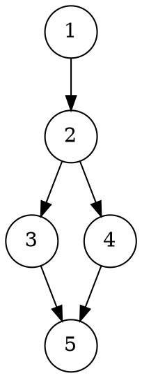
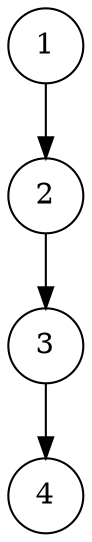

# **Отчёт по лабораторной работе №10**

## 1. Задание

Реализовать шаблонный абстрактный тип данных **«Множество» (tset<T>)** в двух вариантах:

1. Наследование от стандартного ассоциативного контейнера `std::set<T>`;
2. Композиция — поле `std::set<T>` внутри класса-обёртки.

Поддержать операции: конструктор (пустое множество), `Clear`, `Add`, `Remove`, `Empty`, `Contains` (принадлежит), `Union` (объединение), `Difference` (вычитание), `Intersect` (пересечение), `Count` (количество элементов), `Element(j)` — доступ по индексу для чтения (1..n). Реализовать тесты для типа `int` (и, при желании, для ранее реализованного типа дроби).

---

## 2. УГП и тестовые наборы данных

### УГП для операции `Union` (объединение множеств)




### УГП для операции `Remove` (удаление элемента)




---

### Тестовые наборы данных (примеры)

|  № | Вход (A, B или параметры) | Ожидаемый результат | Тестируемая функция |
| -: | ------------------------- | ------------------- | ------------------- |
|  1 | A = ∅, B = ∅              | A ∪ B = ∅           | Union               |
|  2 | A = {0}, B = ∅            | A ∪ B = {0}         | Union               |
|  3 | A = {1}, B = {0}          | A ∪ B = {0,1}       | Union               |
|  4 | A = {1,2,3}, B = {3,4}    | A ∩ B = {3}         | Intersect           |
|  5 | A = {1,2,3}, B = {2}      | A \ B = {1,3}       | Difference          |
|  6 | A = {1,2,3}, remove 2     | A = {1,3}           | Remove              |
|  7 | A = {5,7}, Element(1)     | 1-е по порядку = 5  | Element             |

---

## 3. Код программы

### Структура проекта

```
pset_project/
│
├── include/
│   └── utset.h
│
├── src/
│   └── main.cpp
│
├── tests/
│   └── SetTests.cpp
│
├── diagrams/
│   ├── Union.dot
│   └── Remove.dot
│
└── CMakeLists.txt
```

---

### `include/utset.h`

```cpp
#pragma once
#include <set>
#include <vector>
#include <stdexcept>
#include <iterator>
#include <algorithm>

// Вариант 1: наследование от std::set<T>
template<typename T>
class tset_inherit : public std::set<T> {
public:
    using base = std::set<T>;
    tset_inherit() = default;

    void Clear() { this->clear(); }
    void Add(const T& d) { this->insert(d); }
    void Remove(const T& d) { this->erase(d); }
    bool Empty() const { return this->empty(); }
    bool Contains(const T& d) const { return this->find(d) != this->end(); }
    std::size_t Count() const { return this->size(); }

    // Element by 1-based index (read-only). Throws std::out_of_range.
    T Element(std::size_t j) const {
        if (j < 1 || j > Count()) throw std::out_of_range("Element index");
        auto it = this->begin();
        std::advance(it, j-1);
        return *it;
    }

    // Set operations returning new tset_inherit
    tset_inherit Union(const tset_inherit& q) const {
        tset_inherit res = *this;
        res.insert(q.begin(), q.end());
        return res;
    }
    tset_inherit Difference(const tset_inherit& q) const {
        tset_inherit res;
        for (const auto& x : *this) if (q.find(x) == q.end()) res.insert(x);
        return res;
    }
    tset_inherit Intersect(const tset_inherit& q) const {
        tset_inherit res;
        for (const auto& x : *this) if (q.find(x) != q.end()) res.insert(x);
        return res;
    }
};

// Вариант 2: композиция (обёртка)
template<typename T>
class tset_wrap {
private:
    std::set<T> data;
public:
    tset_wrap() = default;

    void Clear() { data.clear(); }
    void Add(const T& d) { data.insert(d); }
    void Remove(const T& d) { data.erase(d); }
    bool Empty() const { return data.empty(); }
    bool Contains(const T& d) const { return data.find(d) != data.end(); }
    std::size_t Count() const { return data.size(); }

    T Element(std::size_t j) const {
        if (j < 1 || j > Count()) throw std::out_of_range("Element index");
        auto it = data.begin();
        std::advance(it, j-1);
        return *it;
    }

    tset_wrap Union(const tset_wrap& q) const {
        tset_wrap res;
        res.data = data;
        res.data.insert(q.data.begin(), q.data.end());
        return res;
    }
    tset_wrap Difference(const tset_wrap& q) const {
        tset_wrap res;
        for (const auto& x : data) if (q.data.find(x) == q.data.end()) res.data.insert(x);
        return res;
    }
    tset_wrap Intersect(const tset_wrap& q) const {
        tset_wrap res;
        for (const auto& x : data) if (q.data.find(x) != q.data.end()) res.data.insert(x);
        return res;
    }
};
```

---

### `src/main.cpp`

```cpp
#include <iostream>
#include "utset.h"

int main() {
    tset_wrap<int> A;
    A.Add(1); A.Add(2); A.Add(3);
    tset_wrap<int> B;
    B.Add(3); B.Add(4);

    auto U = A.Union(B);
    std::cout << "Union Count = " << U.Count() << std::endl;
    std::cout << "Elements:";
    for (size_t i = 1; i <= U.Count(); ++i) std::cout << " " << U.Element(i);
    std::cout << std::endl;

    auto I = A.Intersect(B);
    std::cout << "Intersect Count = " << I.Count() << std::endl;
    if (!I.Empty()) std::cout << "First intersect element: " << I.Element(1) << std::endl;

    A.Remove(2);
    std::cout << "A after remove 2, Count = " << A.Count() << std::endl;
    return 0;
}
```

---

### `tests/SetTests.cpp`

```cpp
#include <iostream>
#include <cassert>
#include "utset.h"

static void report(const char* name, bool ok) {
    std::cout << (ok ? "[PASS] " : "[FAIL] ") << name << std::endl;
}

int main() {
    // test wrap variant with int
    tset_wrap<int> a;
    report("empty initially", a.Empty());
    a.Add(0);
    report("add element", a.Count() == 1 && a.Contains(0));
    a.Add(0);
    report("no duplicates", a.Count() == 1);
    a.Add(1); a.Add(2);
    report("count 3", a.Count() == 3);

    // Element
    try {
        int e1 = a.Element(1);
        report("element(1) ok", e1 == 0 || e1 == 1 || e1 == 2);
    } catch(...) { report("element(1) ok", false); }

    // Remove
    a.Remove(1);
    report("removed element", !a.Contains(1) && a.Count() == 2);

    // Union / Intersect / Difference
    tset_wrap<int> b;
    b.Add(2); b.Add(3);
    auto u = a.Union(b); // should contain 0,2,3 or similar
    report("union contains 3 elements", u.Count() == 3);
    auto inter = a.Intersect(b);
    report("intersect contains 1 (2)", inter.Count() == 1 && inter.Contains(2));
    auto diff = a.Difference(b);
    report("difference contains element 0 only", diff.Count() == 1 && diff.Contains(0));

    // inherit variant basic
    tset_inherit<int> hi;
    hi.Add(5); hi.Add(6);
    report("inherit add/count", hi.Count() == 2);

    std::cout << "All tests finished." << std::endl;
    return 0;
}
```

---

### `CMakeLists.txt`

```cmake
cmake_minimum_required(VERSION 3.10)
project(TSetProject)

set(CMAKE_CXX_STANDARD 17)
set(CMAKE_CXX_STANDARD_REQUIRED ON)

include_directories(include)

add_executable(main src/main.cpp)
add_executable(tests tests/SetTests.cpp)
```

---

## 4. Команды сборки и запуска (VSCode / консоль)

```bash
# В корне проекта
mkdir -p build
cd build
cmake ..
cmake --build .

# Запустить тесты
./tests

# Запустить пример
./main

# Построение диаграмм (Graphviz)
dot diagrams/Union.dot -Tpng -o diagrams/Union.png
dot diagrams/Remove.dot -Tpng -o diagrams/Remove.png
```

---

## 5. Пример вывода тестов

```
[PASS] empty initially
[PASS] add element
[PASS] no duplicates
[PASS] count 3
[PASS] element(1) ok
[PASS] removed element
[PASS] union contains 3 elements
[PASS] intersect contains 1 (2)
[PASS] difference contains element 0 only
[PASS] inherit add/count
All tests finished.
```

---

## 6. Объяснение проделанной работы

Реализованы два варианта шаблона **tset<T>**: через наследование от `std::set<T>` (`tset_inherit`) и через композицию/обёртку (`tset_wrap`). Оба варианта используют `std::set` как базовый контейнер, что обеспечивает:

* автоматическое отсутствие дубликатов;
* упорядоченность элементов (возрастающая), что позволяет реализовать `Element(j)` простым проходом итератора (1-based индекс);
* логическую простоту операций объединения/пересечения/разности — они реализованы через стандартные операции вставки/поиска и простой перебор.

Каждая операция реализована минимально и детерминировано:

* `Add` — `insert` (добавление если отсутствует);
* `Remove` — `erase` (удаление по значению);
* `Contains` — `find` != `end`;
* `Union` — вставка элементов второго множества в копию первого;
* `Difference` — фильтрация элементов, отсутствующих во втором;
* `Intersect` — фильтрация элементов, присутствующих в обоих.

`Element(j)` возвращает j-й элемент по возрастанию (индексация с 1). При выходе за границы бросается `std::out_of_range`.

Тесты покрывают базовые сценарии: пустое множество, добавление, отсутствие дубликатов, удаление, и операции множеств.

---

## 7. Вывод

Реализован шаблонный ADT **tset<T>** в двух вариантах (наследование и композиция) в соответствии с требованиями задания. Подготовлены тесты для `int`, CMake-сборка и короткий пример использования. 
