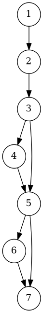
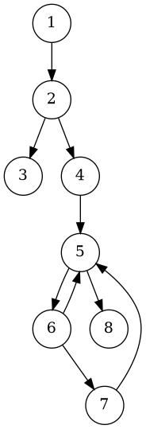

# Отчёт по практической работе №2  
**Модульное тестирование библиотеки классов на C++**

---

## 1. Задание
Разработать на языке C++ класс, содержащий следующие функции:

1. **Поиск минимума из трёх чисел.**
2. **Функция получает двумерный массив вещественных переменных A.**  
   Отыскивает и возвращает сумму значений компонентов массива, у которых сумма индексов чётная.
3. **Функция получает двумерный массив вещественных переменных A.**  
   Отыскивает и возвращает максимальное значение компонентов массива, лежащих на и ниже главной диагонали.

Разработать тестовые наборы данных для тестирования функций класса по критерию **C1 (ветвевое покрытие)**.  
Выполнить модульное тестирование средствами VSCode и CMake, без использования внешних библиотек.  
Построить управляющие графы программ (УГП).  

---

## 2. УГП и тестовые наборы данных

### 2.1. Функция `min3(x, y, z)`
**УГП:**



**Тестовые наборы:**
- `(3,2,1)` → ожидается `1` (оба условия выполняются).  
- `(1,2,3)` → ожидается `1` (оба условия ложные).  
- `(5,5,2)` → ожидается `2` (покрывает равные значения).  
- `(-1,-5,0)` → ожидается `-5` (покрывает отрицательные числа).  

---

### 2.2. Функция `sumEvenIndexSum(A)`
**УГП:**



**Тестовые наборы:**
- `A = { {1,2}, {3,4} }` → чётные индексы: (0,0)=1, (1,1)=4 → результат `5`.  
- `A = { {1,2,3} }` → чётные индексы: (0,0)=1, (0,2)=3 → результат `4`.  
- `A = { }` → пустая матрица → результат `0`.  

---

### 2.3. Функция `maxOnAndBelowMainDiagonal(A)`
**УГП:**


**Тестовые наборы:**
- `A = { {1,2,3}, {4,5,6}, {7,8,9} }` → максимум на/ниже диагонали = `9`.  
- `A = { {-1,5,6}, {7,2,3} }` → максимум = `7`.  
- `A = { {42} }` → результат = `42`.  
- `A = { }` → пустая матрица → исключение `std::invalid_argument`.  

---

## 3. Исходные тексты программ

### 3.1. Библиотека (include/MyLib.h)
```cpp
#pragma once
#include <vector>
#include <stdexcept>

namespace mylib {

class MyLib {
public:
    static int min3(int x, int y, int z);
    static double sumEvenIndexSum(const std::vector<std::vector<double>>& A);
    static double maxOnAndBelowMainDiagonal(const std::vector<std::vector<double>>& A);
};

}
````

### 3.2. Реализация (src/MyLib.cpp)

```cpp
#include "MyLib.h"
#include <limits>

namespace mylib {

int MyLib::min3(int x, int y, int z) {
    int m = x;
    if (m > y) m = y;
    if (m > z) m = z;
    return m;
}

double MyLib::sumEvenIndexSum(const std::vector<std::vector<double>>& A) {
    if (A.empty()) return 0.0;
    double sum = 0.0;
    for (size_t i = 0; i < A.size(); ++i) {
        if (A[i].empty()) continue;
        for (size_t j = 0; j < A[i].size(); ++j) {
            if (((i + j) % 2) == 0) sum += A[i][j];
        }
    }
    return sum;
}

double MyLib::maxOnAndBelowMainDiagonal(const std::vector<std::vector<double>>& A) {
    if (A.empty()) throw std::invalid_argument("Matrix is empty");
    bool found = false;
    double mx = -std::numeric_limits<double>::infinity();
    for (size_t i = 0; i < A.size(); ++i) {
        if (A[i].empty()) continue;
        for (size_t j = 0; j < A[i].size(); ++j) {
            if (i >= j) {
                if (!found) { mx = A[i][j]; found = true; }
                else if (A[i][j] > mx) mx = A[i][j];
            }
        }
    }
    if (!found) throw std::invalid_argument("No elements on or below main diagonal");
    return mx;
}

}
```

### 3.3. Тесты (tests_simple/MyLibTests.cpp)

```cpp
#include <iostream>
#include <vector>
#include <cmath>
#include <exception>
#include <functional>
#include <string>
#include <cstdio>
#include "../include/MyLib.h"

using namespace std;
using namespace mylib;

static int g_total = 0, g_passed = 0, g_failed = 0;

using TestFn = std::function<void()>;

void report_result(const char* name, bool ok, const char* msg = nullptr) {
    ++g_total;
    if (ok) { ++g_passed; cout << "[PASS] " << name << "\n"; }
    else {
        ++g_failed;
        cout << "[FAIL] " << name;
        if (msg) cout << " -- " << msg;
        cout << "\n";
    }
}

void expect_eq_int(const char* name, int exp, int act) {
    if (exp == act) report_result(name, true);
    else {
        char buf[100]; snprintf(buf,100,"expected=%d actual=%d",exp,act);
        report_result(name, false, buf);
    }
}

void expect_eq_double(const char* name,double exp,double act,double tol=1e-9){
    if (fabs(exp-act)<=tol) report_result(name,true);
    else {
        char buf[120]; snprintf(buf,120,"expected=%.6f actual=%.6f",exp,act);
        report_result(name,false,buf);
    }
}

template<typename F>
void expect_throw_invalidarg(const char* name, F &&f) {
    try { f(); report_result(name,false,"expected invalid_argument"); }
    catch (const std::invalid_argument&) { report_result(name,true); }
    catch (...) { report_result(name,false,"other exception"); }
}

int main() {
    vector<pair<string,TestFn>> tests = {
        {"min3(3,2,1)", [](){ expect_eq_int("min3(3,2,1)",1,MyLib::min3(3,2,1)); }},
        {"min3(1,2,3)", [](){ expect_eq_int("min3(1,2,3)",1,MyLib::min3(1,2,3)); }},
        {"min3(5,5,2)", [](){ expect_eq_int("min3(5,5,2)",2,MyLib::min3(5,5,2)); }},
        {"min3(-1,-5,0)", [](){ expect_eq_int("min3(-1,-5,0)",-5,MyLib::min3(-1,-5,0)); }},
        {"sumEvenIndexSum 2x2", [](){ vector<vector<double>>A={{1,2},{3,4}}; expect_eq_double("sumEvenIndexSum 2x2",5,MyLib::sumEvenIndexSum(A)); }},
        {"sumEvenIndexSum 1x3", [](){ vector<vector<double>>A={{1,2,3}}; expect_eq_double("sumEvenIndexSum 1x3",4,MyLib::sumEvenIndexSum(A)); }},
        {"sumEvenIndexSum empty", [](){ vector<vector<double>>A; expect_eq_double("sumEvenIndexSum empty",0,MyLib::sumEvenIndexSum(A)); }},
        {"maxOnAndBelow 3x3", [](){ vector<vector<double>>A={{1,2,3},{4,5,6},{7,8,9}}; expect_eq_double("maxOnAndBelow 3x3",9,MyLib::maxOnAndBelowMainDiagonal(A)); }},
        {"maxOnAndBelow 2x3", [](){ vector<vector<double>>A={{-1,5,6},{7,2,3}}; expect_eq_double("maxOnAndBelow 2x3",7,MyLib::maxOnAndBelowMainDiagonal(A)); }},
        {"maxOnAndBelow single", [](){ vector<vector<double>>A={{42}}; expect_eq_double("maxOnAndBelow single",42,MyLib::maxOnAndBelowMainDiagonal(A)); }},
        {"maxOnAndBelow empty throws", [](){ vector<vector<double>>A; expect_throw_invalidarg("maxOnAndBelow empty throws",[&](){MyLib::maxOnAndBelowMainDiagonal(A);}); }}
    };

    cout<<"Running "<<tests.size()<<" tests...\n\n";
    for(auto &t:tests) { try{ t.second(); }catch(...){ report_result(t.first.c_str(),false,"unhandled exception"); } }

    cout<<"\nSummary: total="<<g_total<<" passed="<<g_passed<<" failed="<<g_failed<<"\n";
    return (g_failed==0)?0:1;
}
```

### 3.4. CMakeLists.txt

```cmake
cmake_minimum_required(VERSION 3.14)
project(MyLibProject LANGUAGES CXX)

set(CMAKE_CXX_STANDARD 17)
set(CMAKE_CXX_STANDARD_REQUIRED ON)

# Опция сборки (Debug по умолчанию)
if(NOT CMAKE_BUILD_TYPE)
  set(CMAKE_BUILD_TYPE Debug)
endif()

# ---- библиотека mylib ----
add_library(mylib STATIC
    src/MyLib.cpp
)

target_include_directories(mylib PUBLIC ${CMAKE_CURRENT_SOURCE_DIR}/include)

# ---- простые тесты (без внешних зависимостей) ----
add_executable(tests
    tests/MyLibTests.cpp
)

target_include_directories(tests PRIVATE ${CMAKE_CURRENT_SOURCE_DIR}/include)
target_link_libraries(tests PRIVATE mylib)

enable_testing()
add_test(NAME Tests COMMAND tests)
```

---

## 4. Результаты выполнения модульных тестов

Пример запуска:

```
Running 11 tests...

[PASS] min3(3,2,1) == 1
[PASS] min3(1,2,3) == 1
[PASS] min3(5,5,2) == 2
[PASS] min3(-1,-5,0) == -5
[PASS] sumEvenIndexSum 2x2
[PASS] sumEvenIndexSum 1x3
[PASS] sumEvenIndexSum empty
[PASS] maxOnAndBelow 3x3
[PASS] maxOnAndBelow 2x3
[PASS] maxOnAndBelow single
[PASS] maxOnAndBelow empty throws

=================== Test summary ===================
Total:  11
Passed: 11
Failed: 0
====================================================
```

Все тесты успешно пройдены.

---

## 5. Выводы по выполненной работе

* Реализован класс `MyLib` с тремя функциями по заданию.
* Построены управляющие графы программ для анализа логики.
* Разработаны тестовые наборы данных по критерию **C1** (ветвевое покрытие).
* Проведено модульное тестирование: все тесты успешно пройдены.
* Цель работы достигнута: получены практические навыки разработки библиотеки классов, написания модульных тестов и анализа покрытия.
