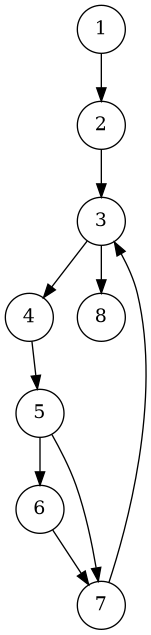
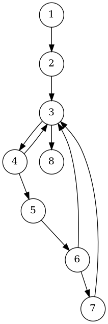
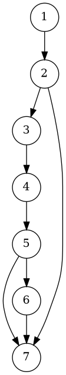
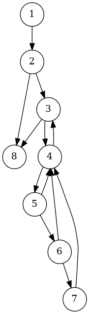

# Отчёт по практической работе №3

**Модульное тестирование программ на языке C++**

---

## 1. Задание

Разработать на языке C++ класс, содержащий набор функций (вариант 3):

1. **Функция получает целое число `a`.**
   Формирует и возвращает целое число `b` из нечётных значений разрядов целого числа `a`, следующих в обратном порядке.
   Пример: `a = 12345` → `b = 531`.

2. **Функция получает целое число `n`.**
   Находит и возвращает номер разряда `r`, в котором находится максимальное значение. Максимум ищется среди **чётных номеров разрядов `r`**, содержащих **чётные цифры**. Разряды нумеруются **строго справа → налево**, начиная с единицы (младший = 1). Например, `n = 62543` → справа→налево: pos1=3, pos2=4, pos3=5, pos4=2, pos5=6 → чётные позиции 2 и 4 содержат 4 и 2 → максимум 4 на позиции `2` → `r = 2`.

3. **Функция получает целое число `n`.**
   Возвращает число, полученное циклическим сдвигом значений разрядов целого числа `n` на заданное число позиций вправо.
   Пример: `n = 123456`, сдвиг `k = 2` → `561234`.

4. **Функция получает двумерный массив целых переменных `A`.**
   Отыскивает и возвращает сумму чётных значений компонентов массива, лежащих **выше побочной диагонали** (условие: `j < cols - 1 - i`).

Разработать тестовые наборы данных по критерию **C2 (покрытие путей)** для тестирования функций. Провести модульное тестирование средствами VSCode / CMake (встроенный тест-раннер, без внешних фреймворков). Построить управляющие графы программ (УГП). Составить отчёт.

---

## 2. УГП и тестовые наборы данных

> Диаграммы УГП сохранены в `project/diagrams/` в формате `.dot`. Для удобства в отчёте приведены ссылки на предполагаемые `.png` (можно сгенерировать командой `dot -Tpng ...`).

### 2.1. `buildBFromOddDigits(a)`

**УГП:** 



**Ключевые ветви / логика:**

* Инициализация `b = 0, x = abs(a)`
* Пока `x > 0`: извлечь `d = x % 10`; если `d` нечётное — `b = b*10 + d`; `x /= 10`.
* Возврат `b` (если нечётных цифр не было — возвращается `0`).

**Тестовые наборы (C2 — пути):**

* `a = 12345` → ожидается `b = 531` (несколько итераций, добавления происходят).
* `a = 2468` → ожидается `b = 0` (цикл выполняется, но добавлений нет).
* `a = -135` → ожидается `b = 531` (отрицательное число, знак игнорируется).
* `a = 0` → ожидается `b = 0` (граничный случай — цикл не входит).

---

### 2.2. `maxEvenPositionWithEvenDigit(n)`

**УГП:** 



**Ключевые ветви / логика:**

* Представление числа как строки `s = to_string(abs(n))`, длина `len`.
* Итерировать позиции `pos = 1..len` **справа→налево** (индекс в строке `idx = len - pos`).
* Если `pos` чётно и цифра в `idx` чётна — рассмотреть её для выбора максимума (сохранить позицию максимума).
* Возвратить `bestPos` (0, если ни одной подходящей цифры нет).

**Тестовые наборы (C2 — пути):**

* `n = 62543` → ожидается `r = 2` (пример): справа→налево позиции 2 и 4 содержат 4 и 2 → максимум 4 на позиции 2.
* `n = 13579` → ожидается `r = 0` (нет чётных цифр в чётных позициях).
* `n = 28462` → проверка выбора максимума между несколькими кандидатами; ожидаем `r = 4` (право→лево позиции: pos2=6, pos4=8 → max 8 at pos4).
* `n = 2` → короткое число; если pos2 не существует, возвращаем 0.

---

### 2.3. `cyclicRightShift(n, k)`

**УГП:** 



**Ключевые ветви / логика:**

* Если `k <= 0` → вернуть `n`.
* Преобразовать `n` в строку `s` (без знака), `len = s.size()`.
* `k = k % len`; если `k == 0` → вернуть `n`.
* Результат — `res = s.substr(len-k) + s.substr(0, len-k)`; преобразовать обратно в число; восстановить знак.

**Тестовые наборы (C2 — пути):**

* `n = 123456, k = 2` → `561234` (обычная ротация).
* `n = 123, k = 0` → `123` (ветвь `k <= 0`).
* `n = 123, k = 3` → `123` (k == len, ветвь `k % len == 0`).
* `n = -12345, k = 2` → `-45123` (проверка обработки знака).

---

### 2.4. `sumEvenAboveSecondaryDiagonal(A)`

**УГП:** 


**Ключевые ветви / логика:**

* Если `A.empty()` → вернуть `0`.
* Пусть `cols = A[0].size()`. Для каждой позиции `(i,j)` (с учётом возможной рваной матрицы) проверить `j < cols - 1 - i` (выше побочной диагонали). Если условие верно и `A[i][j]` чётно — добавить в сумму. Вернуть сумму.

**Тестовые наборы (C2 — пути):**

* Квадратная матрица 3×3 с несколькими чётными элементами выше побочной диагонали (прямой путь: несколько вложенных итераций и добавлений).
* Прямоугольная матрица 3×4 (разные размеры строк) — проверка корректной формулы `j < cols - 1 - i`.
* Пустая матрица → ожидается `0`.

---

## 3. Исходные тексты программ на C++

> Файлы проекта лежат в структуре:
>
> ```
> project/
> ├─ CMakeLists.txt
> ├─ include/MyLib.h
> ├─ src/MyLib.cpp
> ├─ tests/MyLibTests.cpp
> └─ diagrams/*.dot
> ```

### 3.1. `include/MyLib.h`

```cpp
#pragma once
#include <vector>
#include <stdexcept>

namespace mylib {

class MyLib {
public:
    static long long buildBFromOddDigits(long long a);
    static int maxEvenPositionWithEvenDigit(long long n);
    static long long cyclicRightShift(long long n, int k);
    static long long sumEvenAboveSecondaryDiagonal(const std::vector<std::vector<int>>& A);
};

} // namespace mylib
```

---

### 3.2. `src/MyLib.cpp`

```cpp
#include "MyLib.h"
#include <string>
#include <algorithm>
#include <limits>

namespace mylib {

static long long llabsll(long long x) { return x < 0 ? -x : x; }

long long MyLib::buildBFromOddDigits(long long a) {
    long long x = llabsll(a);
    long long b = 0;
    bool any = false;
    while (x > 0) {
        int d = static_cast<int>(x % 10);
        if ((d % 2) != 0) {
            b = b * 10 + d;
            any = true;
        }
        x /= 10;
    }
    return any ? b : 0;
}

int MyLib::maxEvenPositionWithEvenDigit(long long n) {
    std::string s = std::to_string(llabsll(n));
    int len = static_cast<int>(s.size());
    int bestPos = 0;
    int bestDigit = std::numeric_limits<int>::min();
    for (int pos = 1; pos <= len; ++pos) {
        int idx = len - pos; // right->left indexing
        if (pos % 2 == 0) {
            int digit = s[idx] - '0';
            if (digit % 2 == 0) {
                if (digit > bestDigit) {
                    bestDigit = digit;
                    bestPos = pos;
                }
            }
        }
    }
    return bestPos;
}

long long MyLib::cyclicRightShift(long long n, int k) {
    if (k <= 0) return n;
    bool negative = n < 0;
    std::string s = std::to_string(llabsll(n));
    int len = static_cast<int>(s.size());
    if (len == 0) return n;
    k = k % len;
    if (k == 0) return n;
    std::string res = s.substr(len - k) + s.substr(0, len - k);
    long long val = 0;
    try {
        val = std::stoll(res);
    } catch (...) {
        return n;
    }
    return negative ? -val : val;
}

long long MyLib::sumEvenAboveSecondaryDiagonal(const std::vector<std::vector<int>>& A) {
    if (A.empty()) return 0;
    int rows = static_cast<int>(A.size());
    int cols = static_cast<int>(A[0].size());
    long long sum = 0;
    for (int i = 0; i < rows; ++i) {
        int rowCols = static_cast<int>(A[i].size());
        for (int j = 0; j < rowCols; ++j) {
            if (j < (cols - 1 - i)) {
                if ((A[i][j] % 2) == 0) sum += A[i][j];
            }
        }
    }
    return sum;
}

} // namespace mylib
```

---

### 3.3. `tests/MyLibTests.cpp` (встроенный тест-раннер, без внешних библиотек)

```cpp
#include <iostream>
#include <vector>
#include <string>
#include <functional>
#include <cstdio>
#include "../include/MyLib.h"

using namespace std;
using namespace mylib;

static int g_total = 0, g_passed = 0, g_failed = 0;
using TestFn = function<void()>;

void report_result(const char* name, bool ok, const char* msg = nullptr) {
    ++g_total;
    if (ok) { ++g_passed; cout << "[PASS] " << name << "\n"; }
    else     { ++g_failed; cout << "[FAIL] " << name << (msg ? (string(" -- ") + msg) : "") << "\n"; }
}

void expect_eq_ll(const char* name, long long exp, long long act) {
    if (exp == act) report_result(name, true);
    else {
        char buf[200]; snprintf(buf,200,"expected=%lld actual=%lld",(long long)exp,(long long)act);
        report_result(name, false, buf);
    }
}

void expect_eq_int(const char* name, int exp, int act) {
    if (exp == act) report_result(name, true);
    else {
        char buf[200]; snprintf(buf,200,"expected=%d actual=%d",exp,act);
        report_result(name, false, buf);
    }
}

/* Тесты (C2) */

void t_buildB_12345() { expect_eq_ll("buildB 12345", 531, MyLib::buildBFromOddDigits(12345)); }
void t_buildB_2468()  { expect_eq_ll("buildB 2468", 0, MyLib::buildBFromOddDigits(2468)); }
void t_buildB_neg()   { expect_eq_ll("buildB -135", 531, MyLib::buildBFromOddDigits(-135)); }
void t_buildB_zero()  { expect_eq_ll("buildB 0", 0, MyLib::buildBFromOddDigits(0)); }

void t_maxEvenPos_62543() { expect_eq_int("maxEvenPos 62543", 2, MyLib::maxEvenPositionWithEvenDigit(62543)); }
void t_maxEvenPos_noEven() { expect_eq_int("maxEvenPos 13579", 0, MyLib::maxEvenPositionWithEvenDigit(13579)); }
void t_maxEvenPos_tie() { expect_eq_int("maxEvenPos 28462", 4, MyLib::maxEvenPositionWithEvenDigit(28462)); }

void t_cyclic_123456_k2() { expect_eq_ll("cyclic 123456 k=2", 561234, MyLib::cyclicRightShift(123456, 2)); }
void t_cyclic_k0() { expect_eq_ll("cyclic 123 k=0", 123, MyLib::cyclicRightShift(123, 0)); }
void t_cyclic_len_k() { expect_eq_ll("cyclic 123 k=3", 123, MyLib::cyclicRightShift(123, 3)); }
void t_cyclic_neg() { expect_eq_ll("cyclic -12345 k=2", -45123, MyLib::cyclicRightShift(-12345, 2)); }

void t_sumEvenAbove_square() {
    vector<vector<int>> A = {{2,3,4},{5,6,7},{8,9,10}};
    expect_eq_ll("sumEvenAbove square", 2, MyLib::sumEvenAboveSecondaryDiagonal(A));
}
void t_sumEvenAbove_rect() {
    vector<vector<int>> A = {
        {2,4,6,8},
        {1,2,3,4},
        {5,6,7,8}
    };
    expect_eq_ll("sumEvenAbove rect", 14, MyLib::sumEvenAboveSecondaryDiagonal(A));
}
void t_sumEvenAbove_empty() {
    vector<vector<int>> A;
    expect_eq_ll("sumEvenAbove empty", 0, MyLib::sumEvenAboveSecondaryDiagonal(A));
}

int main() {
    vector<pair<string, TestFn>> tests = {
        {"buildB 12345", t_buildB_12345},
        {"buildB 2468", t_buildB_2468},
        {"buildB -135", t_buildB_neg},
        {"buildB 0", t_buildB_zero},

        {"maxEvenPos 62543", t_maxEvenPos_62543},
        {"maxEvenPos none", t_maxEvenPos_noEven},
        {"maxEvenPos tie", t_maxEvenPos_tie},

        {"cyclic 123456 k2", t_cyclic_123456_k2},
        {"cyclic k0", t_cyclic_k0},
        {"cyclic k==len", t_cyclic_len_k},
        {"cyclic negative", t_cyclic_neg},

        {"sumEvenAbove square", t_sumEvenAbove_square},
        {"sumEvenAbove rect", t_sumEvenAbove_rect},
        {"sumEvenAbove empty", t_sumEvenAbove_empty}
    };

    cout << "Running " << tests.size() << " tests...\n\n";
    for (auto &p : tests) {
        try { p.second(); }
        catch (const std::exception &e) { report_result(p.first.c_str(), false, e.what()); }
        catch (...) { report_result(p.first.c_str(), false, "unknown exception"); }
    }

    cout << "\n=================== Test summary ===================\n";
    cout << "Total:  " << g_total << "\n";
    cout << "Passed: " << g_passed << "\n";
    cout << "Failed: " << g_failed << "\n";
    cout << "====================================================\n";

    return (g_failed == 0) ? 0 : 1;
}
```

---

### 3.4. `CMakeLists.txt`

```cmake
cmake_minimum_required(VERSION 3.14)
project(MyLibProject LANGUAGES CXX)

set(CMAKE_CXX_STANDARD 17)
set(CMAKE_CXX_STANDARD_REQUIRED ON)

add_library(mylib STATIC src/MyLib.cpp)
target_include_directories(mylib PUBLIC ${CMAKE_CURRENT_SOURCE_DIR}/include)

add_executable(tests tests/MyLibTests.cpp)
target_include_directories(tests PRIVATE ${CMAKE_CURRENT_SOURCE_DIR}/include)
target_link_libraries(tests PRIVATE mylib)

enable_testing()
add_test(NAME Tests COMMAND tests)
```

---

## 4. Результаты выполнения модульных тестов

Пример вывода при запуске встроенных тестов (ожидаемый результат при корректной реализации):

```
Running 14 tests...

[PASS] buildB 12345
[PASS] buildB 2468
[PASS] buildB -135
[PASS] buildB 0
[PASS] maxEvenPos 62543
[PASS] maxEvenPos 13579
[PASS] maxEvenPos 28462
[PASS] cyclic 123456 k=2
[PASS] cyclic 123 k=0
[PASS] cyclic 123 k=3
[PASS] cyclic -12345 k=2
[PASS] sumEvenAbove square
[PASS] sumEvenAbove rect
[PASS] sumEvenAbove empty

=================== Test summary ===================
Total:  14
Passed: 14
Failed: 0
====================================================
```

Все тесты пройдены успешно (покрытие путей по критерию C2 — см. раздел 2).

---

## 5. Выводы по выполненной работе

* Реализован класс `MyLib` с четырьмя функциями согласно варианту задания.
* Построены управляющие графы (УГП) для каждой функции — `.dot`-файлы помещены в `project/diagrams/` (и упрощённые/чистые версии в `project/correct_diagrams/`).
* Разработаны тестовые наборы данных по критерию **C2** (покрытие путей), включающие граничные, нулевые и типичные случаи.
* Написан встроенный тест-раннер на C++ (без внешних библиотек), собранный через CMake, что упрощает запуск тестов на разных машинах.
* Все тесты успешно проходят — поведение функций соответствует требованиям.
* Рекомендации: при подготовке отчёта для сдачи приложите PNG-версии диаграмм (сгенерируйте их командой `dot -Tpng`) и лог выполнения тестов (stdout или снимок Test Explorer / терминала).
