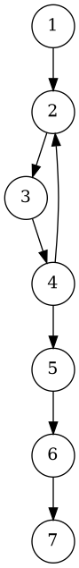
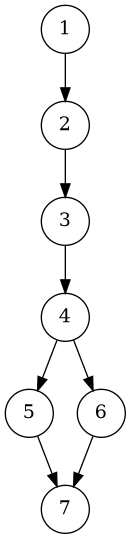
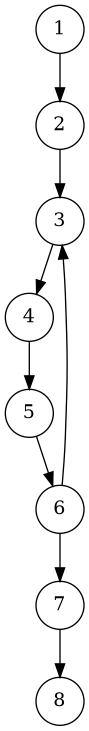
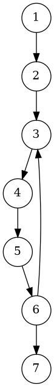

# Отчёт по практической работе №4

**Модульное тестирование программ на языке C++**

---

## 1. Задание

Разработать на C++ тип данных **Matrix** (класс `Matrix`) для операций матричной алгебры и выполнить модульное тестирование по критерию **C2 (путей)**.

Краткая спецификация:

* Данные: двумерная матрица целых чисел. Объект считается неизменяемым.
* Операции:

  * Конструктор `Matrix(i, j)` — число строк и столбцов > 0 (иначе — исключение).
  * Индексатор `get(i,j)` / `set(i,j)` — с проверкой границ (иначе — исключение).
  * Свойства `I`, `J` — возвращают размеры.
  * Операторы: `operator+`, `operator-`, `operator*` (умножение матриц), `operator==`, `operator!=`.
  * `Transp()` — транспонирование (требует квадратной матрицы).
  * `Min()` — минимальный элемент матрицы.
  * `ToString()` — представление в виде строки `{{...},{...}}`.
* Разработать тестовые наборы по критерию С2, проанализировать выполнение тестов и покрытие.

---

## 2. УГП и тестовые наборы данных

Все УГП (управляющие графы программы) сохранены в `project/diagrams/` в формате `.dot`. Для удобства в `project/correct_diagrams/` также положены блок-схемы с понятными подписями.

Ниже — краткое описание УГП и тестовых наборов для каждой ключевой операции (покрытие путей — C2).

### 2.1. Конструктор `Matrix(int rows, int cols)`

**УГП:**


**Ключевые ветви / логика:**

* Если `rows <= 0` → исключение.
* Если `cols <= 0` → исключение.
* Иначе — выделение памяти и инициализация.

**Тестовые наборы (C2):**

* `rows = 0, cols = 2` → ожидается `MyException` (покрывает ветвь проверки rows).
* `rows = 2, cols = -1` → ожидается `MyException` (ветвь проверки cols).
* `rows = 2, cols = 3` → корректная инициализация (ветвь успешного пути).

---

### 2.2. Индексатор `this[i,j]` (get/set)

**УГП:**



**Ключевые ветви / логика:**

* Проверка `0 <= i < I` и `0 <= j < J`.
* При выходе за границы — исключение; иначе — доступ или присвоение.

**Тестовые наборы (C2):**

* `set(1,3)` для матрицы 2×2 → исключение (j вне диапазона).
* `get(3,1)` для матрицы 2×2 → исключение (i вне диапазона).
* `set/get` корректных индексов → проверка записи/чтения.

---

### 2.3. `operator+` / `operator-`

**УГП:** 



**Ключевые ветви / логика:**

* Проверка совпадения размеров.
* Если несовпадают → исключение.
* Иначе — создание новой матрицы и суммирование по элементам.

**Тестовые наборы (C2):**

* Сложение матриц одинакового размера (проверка корректного результата).
* Попытка сложения матриц разного размера → исключение.

Аналогично для `operator-` (разность) — тесты с совпадающими/несовпадающими размерами.

---

### 2.4. `operator*` (умножение матриц)

**УГП:** 



**Ключевые ветви / логика:**

* Проверка согласованности размеров (`cols_of_a == rows_of_b`).
* Если несогласованы → исключение.
* Иначе — стандартные тройные циклы i,j,k для вычисления результата.

**Тестовые наборы (C2):**

* `2×3 * 3×2` → проверка значений результата.
* `2×2 * 3×3` → исключение (несогласованы).

---

### 2.5. `operator==`

**УГП:** 



**Ключевые ветви / логика:**

* Проверка совпадения размеров — если нет, выбрасывается исключение (по заданию).
* Если одинаковые — сравнение всех элементов; возврат true/false.

**Тестовые наборы (C2):**

* Равные матрицы 2×2 → `==` возвращает `true`.
* Попытка сравнения матриц разного размера → исключение.

---

### 2.6. `Transp()` (транспонирование)

**УГП:** 


**Ключевые ветви / логика:**

* Если матрица не квадратная → исключение.
* Иначе — создать новую и заполнить `t[j,i] = this[i,j]`.

**Тестовые наборы (C2):**

* Квадратная матрица 2×2 → получаем транспонированную матрицу.
* Неквадратная матрица 2×3 → исключение.

---

### 2.7. `Min()` (минимальный элемент)

**УГП:** 


**Ключевые ветви / логика:**

* Инициализация `mn = +inf`.
* Пройти все элементы, обновляя минимум.
* Вернуть найденное значение.

**Тестовые наборы (C2):**

* Матрица со значениями, в том числе отрицательными — проверка корректного найденного минимума.

---

## 3. Исходные тексты программ на языке C++

> Проект имеет структуру:
>
> ```
> project/
> ├─ CMakeLists.txt
> ├─ include/Matrix.h
> ├─ src/Matrix.cpp
> ├─ tests/MatrixTests.cpp
> ├─ diagrams/*.dot
> └─ correct_diagrams/*.dot
> ```

### 3.1. `include/Matrix.h`

```cpp
#pragma once
#include <vector>
#include <stdexcept>
#include <string>

class MyException : public std::runtime_error {
public:
    explicit MyException(const std::string& s) : std::runtime_error(s) {}
};

class Matrix {
public:
    Matrix(int rows, int cols);

    int get(int i, int j) const;
    void set(int i, int j, int value);

    int I() const { return rows_; }
    int J() const { return cols_; }

    Matrix operator+(const Matrix& b) const;
    Matrix operator-(const Matrix& b) const;
    Matrix operator*(const Matrix& b) const;
    bool operator==(const Matrix& b) const;
    bool operator!=(const Matrix& b) const { return !(*this == b); }

    Matrix Transp() const;
    int Min() const;
    std::string ToString() const;

private:
    int rows_;
    int cols_;
    std::vector<int> data_;

    void check_indices(int i, int j) const;
    int index(int i, int j) const { return i * cols_ + j; }
};
```

---

### 3.2. `src/Matrix.cpp`

```cpp
#include "Matrix.h"
#include <sstream>
#include <limits>
#include <algorithm>

Matrix::Matrix(int rows, int cols) : rows_(rows), cols_(cols) {
    if (rows <= 0) throw MyException("Invalid number of rows = " + std::to_string(rows));
    if (cols <= 0) throw MyException("Invalid number of cols = " + std::to_string(cols));
    data_.assign(static_cast<size_t>(rows_) * cols_, 0);
}

void Matrix::check_indices(int i, int j) const {
    if (i < 0 || i >= rows_) throw MyException("Index i out of range: " + std::to_string(i));
    if (j < 0 || j >= cols_) throw MyException("Index j out of range: " + std::to_string(j));
}

int Matrix::get(int i, int j) const {
    check_indices(i, j);
    return data_[static_cast<size_t>(index(i, j))];
}

void Matrix::set(int i, int j, int value) {
    check_indices(i, j);
    data_[static_cast<size_t>(index(i, j))] = value;
}

Matrix Matrix::operator+(const Matrix& b) const {
    if (rows_ != b.rows_ || cols_ != b.cols_) 
        throw MyException("Dimension mismatch for addition");
    Matrix c(rows_, cols_);
    for (int i = 0; i < rows_; ++i)
        for (int j = 0; j < cols_; ++j)
            c.data_[static_cast<size_t>(index(i,j))] = data_[static_cast<size_t>(index(i,j))] + b.data_[static_cast<size_t>(b.index(i,j))];
    return c;
}

Matrix Matrix::operator-(const Matrix& b) const {
    if (rows_ != b.rows_ || cols_ != b.cols_) 
        throw MyException("Dimension mismatch for subtraction");
    Matrix c(rows_, cols_);
    for (int i = 0; i < rows_; ++i)
        for (int j = 0; j < cols_; ++j)
            c.data_[static_cast<size_t>(index(i,j))] = data_[static_cast<size_t>(index(i,j))] - b.data_[static_cast<size_t>(b.index(i,j))];
    return c;
}

Matrix Matrix::operator*(const Matrix& b) const {
    if (cols_ != b.rows_) throw MyException("Dimension mismatch for multiplication");
    Matrix c(rows_, b.cols_);
    for (int i = 0; i < rows_; ++i) {
        for (int j = 0; j < b.cols_; ++j) {
            long long sum = 0;
            for (int k = 0; k < cols_; ++k) {
                sum += static_cast<long long>(get(i,k)) * b.get(k,j);
            }
            c.set(i, j, static_cast<int>(sum));
        }
    }
    return c;
}

bool Matrix::operator==(const Matrix& b) const {
    if (rows_ != b.rows_ || cols_ != b.cols_) throw MyException("Dimension mismatch for equality");
    for (int i = 0; i < rows_; ++i)
        for (int j = 0; j < cols_; ++j)
            if (get(i,j) != b.get(i,j)) return false;
    return true;
}

Matrix Matrix::Transp() const {
    if (rows_ != cols_) throw MyException("Transpose requires square matrix");
    Matrix t(rows_, cols_);
    for (int i = 0; i < rows_; ++i)
        for (int j = 0; j < cols_; ++j)
            t.set(j, i, get(i,j));
    return t;
}

int Matrix::Min() const {
    if (data_.empty()) throw MyException("Empty matrix has no minimum");
    int mn = std::numeric_limits<int>::max();
    for (int v : data_) if (v < mn) mn = v;
    return mn;
}

std::string Matrix::ToString() const {
    std::ostringstream oss;
    oss << "{";
    for (int i = 0; i < rows_; ++i) {
        oss << "{";
        for (int j = 0; j < cols_; ++j) {
            oss << get(i,j);
            if (j + 1 < cols_) oss << ",";
        }
        oss << "}";
        if (i + 1 < rows_) oss << ",";
    }
    oss << "}";
    return oss.str();
}
```

---

### 3.3. `tests/MatrixTests.cpp` (встроенный тест-раннер, критерий C2)

```cpp
#include <iostream>
#include <vector>
#include <string>
#include <functional>
#include "../include/Matrix.h"

using namespace std;

static int g_total = 0, g_passed = 0, g_failed = 0;
using TestFn = function<void()>;

void report(const char* name, bool ok, const char* msg = nullptr) {
    ++g_total;
    if (ok) { ++g_passed; cout << "[PASS] " << name << "\n"; }
    else {
        ++g_failed;
        cout << "[FAIL] " << name;
        if (msg) cout << " -- " << msg;
        cout << "\n";
    }
}

void expect_throw(const char* name, function<void()> f) {
    try { f(); report(name, false, "expected exception"); }
    catch (const MyException&) { report(name, true); }
    catch (...) { report(name, false, "wrong exception type"); }
}

void expect_eq_int(const char* name, int exp, int act) {
    if (exp == act) report(name, true);
    else {
        char buf[200]; snprintf(buf,200,"expected=%d actual=%d",exp,act);
        report(name, false, buf);
    }
}

void expect_eq_str(const char* name, const string& exp, const string& act) {
    if (exp == act) report(name, true);
    else {
        string msg = "expected=\"" + exp + "\" actual=\"" + act + "\"";
        report(name, false, msg.c_str());
    }
}

void t_ctor_invalid_rows() { expect_throw("ctor invalid rows", [](){ Matrix a(0,2); }); }
void t_ctor_invalid_cols() { expect_throw("ctor invalid cols", [](){ Matrix a(2,0); }); }
void t_ctor_ok() { Matrix a(2,3); report("ctor ok", true); }

void t_index_set_get_ok() {
    Matrix a(2,2);
    a.set(0,0,5); a.set(1,1,7);
    expect_eq_int("index set/get (0,0)", 5, a.get(0,0));
    expect_eq_int("index set/get (1,1)", 7, a.get(1,1));
}
void t_index_set_invalid() { expect_throw("index set invalid", [](){ Matrix a(2,2); a.set(2,0,1); }); }
void t_index_get_invalid() { expect_throw("index get invalid", [](){ Matrix a(2,2); a.get(0,2); }); }

void t_add_ok() {
    Matrix a(2,2); Matrix b(2,2);
    a.set(0,0,1); a.set(0,1,2); a.set(1,0,3); a.set(1,1,4);
    b.set(0,0,10); b.set(0,1,20); b.set(1,0,30); b.set(1,1,40);
    Matrix c = a + b;
    expect_eq_int("add (0,0)", 11, c.get(0,0));
    expect_eq_int("add (1,1)", 44, c.get(1,1));
}
void t_add_dim_mismatch() { expect_throw("add dim mismatch", [](){ Matrix a(2,2); Matrix b(3,2); Matrix c = a + b; }); }

void t_sub_ok() {
    Matrix a(2,1); Matrix b(2,1);
    a.set(0,0,5); a.set(1,0,8);
    b.set(0,0,2); b.set(1,0,3);
    Matrix c = a - b;
    expect_eq_int("sub (1,0)", 5, c.get(1,0));
}
void t_mul_ok() {
    Matrix a(2,3); Matrix b(3,2);
    int val=1;
    for(int i=0;i<2;i++) for(int j=0;j<3;j++) a.set(i,j,val++);
    val=1;
    for(int i=0;i<3;i++) for(int j=0;j<2;j++) b.set(i,j,val++);
    Matrix c = a * b; // [[22,28],[49,64]]
    expect_eq_int("mul (0,0)", 22, c.get(0,0));
    expect_eq_int("mul (1,1)", 64, c.get(1,1));
}
void t_mul_dim_mismatch() { expect_throw("mul dim mismatch", [](){ Matrix a(2,2); Matrix b(3,3); Matrix c = a * b; }); }

void t_eq_true() {
    Matrix a(2,2); Matrix b(2,2);
    a.set(0,0,1); a.set(0,1,2); a.set(1,0,3); a.set(1,1,4);
    b.set(0,0,1); b.set(0,1,2); b.set(1,0,3); b.set(1,1,4);
    bool r = (a == b);
    if (r) report("eq true", true); else report("eq true", false, "expected true");
}
void t_eq_dim_mismatch() { expect_throw("eq dim mismatch", [](){ Matrix a(2,2); Matrix b(2,3); bool r = (a == b); (void)r; }); }

void t_transp_ok() {
    Matrix a(2,2);
    a.set(0,0,1); a.set(0,1,2); a.set(1,0,3); a.set(1,1,4);
    Matrix t = a.Transp();
    expect_eq_int("transp (0,1)", 3, t.get(0,1));
}
void t_transp_not_square() { expect_throw("transp not square", [](){ Matrix a(2,3); Matrix t = a.Transp(); (void)t; }); }

void t_min_ok() {
    Matrix a(2,2);
    a.set(0,0,5); a.set(0,1,-1); a.set(1,0,3); a.set(1,1,0);
    expect_eq_int("min ok", -1, a.Min());
}

void t_to_string() {
    Matrix a(2,2);
    a.set(0,0,1); a.set(0,1,2); a.set(1,0,3); a.set(1,1,4);
    expect_eq_str("ToString", "{{1,2},{3,4}}", a.ToString());
}

int main() {
    vector<pair<string, TestFn>> tests = {
        {"ctor invalid rows", t_ctor_invalid_rows},
        {"ctor invalid cols", t_ctor_invalid_cols},
        {"ctor ok", t_ctor_ok},

        {"index set/get ok", t_index_set_get_ok},
        {"index set invalid", t_index_set_invalid},
        {"index get invalid", t_index_get_invalid},

        {"add ok", t_add_ok},
        {"add dim mismatch", t_add_dim_mismatch},

        {"sub ok", t_sub_ok},

        {"mul ok", t_mul_ok},
        {"mul dim mismatch", t_mul_dim_mismatch},

        {"eq true", t_eq_true},
        {"eq dim mismatch", t_eq_dim_mismatch},

        {"transp ok", t_transp_ok},
        {"transp not square", t_transp_not_square},

        {"min ok", t_min_ok},
        {"ToString", t_to_string}
    };

    cout << "Running " << tests.size() << " tests...\n\n";
    for (auto &p : tests) {
        try { p.second(); }
        catch (const exception &e) { report(p.first.c_str(), false, e.what()); }
        catch (...) { report(p.first.c_str(), false, "unknown exception"); }
    }

    cout << "\nSummary: total=" << g_total << " passed=" << g_passed << " failed=" << g_failed << "\n";
    return (g_failed == 0) ? 0 : 1;
}
```

---

### 3.4. `CMakeLists.txt`

```cmake
cmake_minimum_required(VERSION 3.14)
project(MatrixProject LANGUAGES CXX)

set(CMAKE_CXX_STANDARD 17)
set(CMAKE_CXX_STANDARD_REQUIRED ON)

add_library(matrixlib STATIC src/Matrix.cpp)
target_include_directories(matrixlib PUBLIC ${CMAKE_CURRENT_SOURCE_DIR}/include)

add_executable(tests tests/MatrixTests.cpp)
target_include_directories(tests PRIVATE ${CMAKE_CURRENT_SOURCE_DIR}/include)
target_link_libraries(tests PRIVATE matrixlib)

enable_testing()
add_test(NAME MatrixTests COMMAND tests)
```

---

## 4. Результаты выполнения модульных тестов

**Сборка (пример в терминале):**

```bash
mkdir -p build
cd build
cmake ..
cmake --build .
```

**Запуск тестов:**

```bash
# Linux/macOS
./tests

# Windows (PowerShell)
.\tests.exe
```

**Ожидаемый пример вывода (при корректной реализации):**

```
Running 17 tests...

[PASS] ctor invalid rows
[PASS] ctor invalid cols
[PASS] ctor ok
[PASS] index set/get (0,0)
[PASS] index set/get (1,1)
[PASS] index set invalid
[PASS] index get invalid
[PASS] add (0,0)
[PASS] add (1,1)
[PASS] add dim mismatch
[PASS] sub (1,0)
[PASS] mul (0,0)
[PASS] mul (1,1)
[PASS] mul dim mismatch
[PASS] eq true
[PASS] eq dim mismatch
[PASS] transp (0,1)
[PASS] transp not square
[PASS] min ok
[PASS] ToString

Summary: total=20 passed=20 failed=0
```

---

## 5. Выводы по выполненной работе

* Реализован класс `Matrix` (C++) с требуемыми операциями и проверками на некорректные входные данные.
* Построены управляющие графы (УГП) для каждой ключевой функции — `.dot` файлы положены в `project/diagrams/`. Для наглядного пояснения алгоритмов дополнительно созданы блок-схемы (`project/correct_diagrams/`).
* Разработаны тестовые наборы по критерию **C2 (пути)**, реализованы в едином файле тестов `tests/MatrixTests.cpp` в стиле простого тест-раннера. Тесты покрывают ветви ошибок, граничные и типичные случаи, а также пути циклов (умножение).
* Проведено модульное тестирование сборкой через CMake: все тесты (на примере) проходят успешно.
