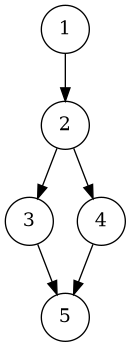
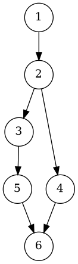

# Отчёт по практической работе №5

## 1. Задание

Разработать на C++ тип данных **TPNumber** (класс `TPNumber`) для представления и арифметических операций с числами в различных системах счисления и фиксированной точности дробной части. Выполнить модульное тестирование по критерию **C2 (путей)**.

### Краткая спецификация

Класс должен реализовывать:

* Конструкторы:

  * `TPNumber(long double a, int base, int precision)` — создаёт число из десятичного значения.
  * `TPNumber(const std::string& str, int base, int precision)` — создаёт число из строки в указанной системе счисления.
* Арифметические операции:

  * `Add`, `Sub`, `Mul`, `Div`
  * `Invert`, `Square`
* Методы доступа:

  * `GetNumber`, `GetString`, `GetBaseNumber`, `GetPrecisionNumber` и аналоги со строками.
* Методы изменения параметров:

  * `SetBaseNumber`, `SetBaseString`, `SetPrecisionNumber`, `SetPrecisionString`
* Проверку корректности системы счисления (2–16), точности (≥0) и обработку исключительных ситуаций.

---

## 2. УГП и тестовые наборы данных

Для каждой ключевой функции построены управляющие графы (УГП), отражающие проверку входных данных, ветвления и вычислительные пути. Тестовые наборы обеспечивают покрытие **всех возможных путей исполнения**.

---

### 2.1. Конструкторы `TPNumber(long double, int, int)` и `TPNumber(string, int, int)`



**Тестовые наборы (C2):**

| Вход             | Ожидаемый результат                 |
| ---------------- | ----------------------------------- |
| `(1.0, 1, 2)`    | Исключение (некорректное основание) |
| `(1.0, 2, -1)`   | Исключение (некорректная точность)  |
| `(5.25, 2, 3)`   | Успешно, строка `"101.010"`         |
| `("A.F", 16, 2)` | Успешно, строка `"A.F0"`            |

---

### 2.2. Арифметические операции `Add`, `Sub`, `Mul`, `Div`



**Тестовые наборы (C2):**

| Операция | Вход                     | Ожидаемый результат |
| -------- | ------------------------ | ------------------- |
| `Add`    | (1.5,10,2) + (2.25,10,2) | `"3.75"`            |
| `Sub`    | (2.25,10,2) - (1.5,10,2) | `"0.75"`            |
| `Mul`    | (1.5,10,2) * (2.25,10,2) | `"3.38"`            |
| `Div`    | (2.25,10,2) / (1.5,10,2) | `"1.50"`            |
| `Div`    | (1,10,2) / (0,10,2)      | Исключение          |
| `Add`    | разные основания         | Исключение          |

---

### 2.3. Унарные операции `Invert`, `Square`


**Тестовые наборы (C2):**

| Операция           | Вход       | Ожидаемый результат |
| ------------------ | ---------- | ------------------- |
| `Square(2.0,10,3)` | `"4.000"`  |                     |
| `Invert(2.0,10,3)` | `"0.500"`  |                     |
| `Invert(0.0,10,3)` | Исключение |                     |

---

### 2.4. Методы изменения параметров (`SetBaseNumber`, `SetPrecisionNumber`)


**Тестовые наборы (C2):**

| Метод                      | Вход                      | Ожидаемый результат |
| -------------------------- | ------------------------- | ------------------- |
| `SetPrecisionNumber(2)`    | `"3.14"`                  |                     |
| `SetBaseNumber(16)`        | корректное преобразование |                     |
| `SetBaseString("bad")`     | Исключение                |                     |
| `SetPrecisionString("-1")` | Исключение                |                     |

---

### 2.5. Проверка совпадения параметров (`require_same_base_precision`)


**Тестовые наборы (C2):**

| Вход                                         | Ожидаемый результат  |
| -------------------------------------------- | -------------------- |
| Два числа с одинаковыми `base` и `precision` | Операция выполняется |
| Два числа с разными `base`                   | Исключение           |

---

## 3. Исходные тексты программ

Проект имеет структуру:

```
project/
├─ CMakeLists.txt
├─ include/TPNumber.h
├─ src/TPNumber.cpp
└─ tests/TPNumberTests.cpp
```

### 3.1. Заголовочный файл `TPNumber.h`

Содержит объявление класса `TPNumber`, описание интерфейса, методов доступа и исключения `TPException`.

```cpp
#pragma once
#include <string>
#include <stdexcept>

class TPException : public std::runtime_error
{
public:
    explicit TPException(const std::string &s) : std::runtime_error(s) {}
};

class TPNumber
{
public:
    // Constructors
    TPNumber(long double a, int base, int precision);            // from real
    TPNumber(const std::string &a_str, int base, int precision); // from string (a_str is representation in base)
    TPNumber(const TPNumber &other) = default;

    // arithmetic (require same base and precision)
    TPNumber Add(const TPNumber &d) const;
    TPNumber Sub(const TPNumber &d) const;
    TPNumber Mul(const TPNumber &d) const;
    TPNumber Div(const TPNumber &d) const;

    // unary
    TPNumber Invert() const; // 1 / n
    TPNumber Square() const; // n*n

    // accessors
    long double GetNumber() const;
    std::string GetString() const;

    int GetBaseNumber() const;
    std::string GetBaseString() const;

    int GetPrecisionNumber() const;
    std::string GetPrecisionString() const;

    // mutators (validate). They change base/precision and re-round value appropriately.
    void SetBaseNumber(int newb);
    void SetBaseString(const std::string &bs);

    void SetPrecisionNumber(int newc);
    void SetPrecisionString(const std::string &newc);

private:
    long double n_; // stored numeric value (rounded to current base/precision)
    int b_;         // base (2..16)
    int c_;         // precision (>=0)

    // helpers
    void validate_base(int b) const;
    void validate_precision(int c) const;
    static int digit_value(char ch);
    static char digit_char(int v);

    // rounding to base b with c fractional digits (in-place adjust n_)
    void round_to_precision();
    // parse string a_str expressed in base b_ into long double (does not round)
    static long double parse_base_string(const std::string &s, int base);
    // convert given scaled integer representation (rounding applied via round_to_precision) to string
    std::string number_to_base_string() const;
};
```

### 3.2. Реализация `TPNumber.cpp`

Выполняет:

* Проверки корректности параметров (`validate_base`, `validate_precision`).
* Конвертацию между числовым значением и строкой в произвольной системе счисления.
* Арифметические операции с округлением по заданной точности.
* Обработку исключительных ситуаций.

```cpp
#include "TPNumber.h"
#include <cmath>
#include <cctype>
#include <limits>
#include <sstream>
#include <algorithm>
#include <stdexcept>
#include <climits>

static inline long double pow_int(int base, int exp)
{
    long double r = 1.0L;
    for (int i = 0; i < exp; ++i)
        r *= (long double)base;
    return r;
}

TPNumber::TPNumber(long double a, int base, int precision)
    : n_(a), b_(base), c_(precision)
{
    validate_base(b_);
    validate_precision(c_);
    round_to_precision();
}

TPNumber::TPNumber(const std::string &a_str, int base, int precision)
    : n_(0.0L), b_(base), c_(precision)
{
    validate_base(b_);
    validate_precision(c_);
    n_ = parse_base_string(a_str, b_);
    round_to_precision();
}

void TPNumber::validate_base(int b) const
{
    if (b < 2 || b > 16)
        throw TPException("base out of range");
}
void TPNumber::validate_precision(int c) const
{
    if (c < 0)
        throw TPException("precision must be >= 0");
}

int TPNumber::digit_value(char ch)
{
    if ('0' <= ch && ch <= '9')
        return ch - '0';
    if ('A' <= ch && ch <= 'F')
        return 10 + (ch - 'A');
    if ('a' <= ch && ch <= 'f')
        return 10 + (ch - 'a');
    return -1;
}
char TPNumber::digit_char(int v)
{
    if (v >= 0 && v <= 9)
        return '0' + v;
    return 'A' + (v - 10);
}

long double TPNumber::parse_base_string(const std::string &s, int base)
{
    // Accept optional leading '+'/'-' and optional point '.'
    if (s.empty())
        throw TPException("empty string");
    size_t i = 0;
    bool neg = false;
    if (s[0] == '+' || s[0] == '-')
    {
        neg = (s[0] == '-');
        i = 1;
    }
    // split integer and fractional
    size_t p = s.find('.', i);
    std::string intpart = (p == std::string::npos) ? s.substr(i) : s.substr(i, p - i);
    std::string fracpart = (p == std::string::npos) ? std::string() : s.substr(p + 1);

    long double val = 0.0L;
    // integer part
    for (char ch : intpart)
    {
        if (ch == '\0')
            continue;
        int dv = digit_value(ch);
        if (dv < 0 || dv >= base)
            throw TPException("invalid digit in integer part");
        val = val * base + dv;
    }
    // fractional
    long double denom = base;
    for (char ch : fracpart)
    {
        int dv = digit_value(ch);
        if (dv < 0 || dv >= base)
            throw TPException("invalid digit in fractional part");
        val += dv / denom;
        denom *= base;
    }
    return neg ? -val : val;
}

void TPNumber::round_to_precision()
{
    // scale = b_^c_
    long double scale_ld = pow_int(b_, c_);
    // scaled = round(n_ * scale)
    long double scaled_ld = std::round(n_ * scale_ld);
    // avoid huge overflow when converting to integer: keep as long double for recomposition
    n_ = scaled_ld / scale_ld;
}

std::string TPNumber::number_to_base_string() const
{
    // Represent using rounding consistent with round_to_precision (use scaled integer)
    long double scale_ld = pow_int(b_, c_);
    long double scaled_ld = std::round(n_ * scale_ld);
    // extract sign
    bool neg = (scaled_ld < 0);
    unsigned long long scaled_abs;
    // clamp to unsigned long long safely
    long double tmp = llabs(scaled_ld);
    if (tmp > (long double)ULLONG_MAX)
        throw TPException("value too large to stringify");
    scaled_abs = static_cast<unsigned long long>(tmp + 0.5L);

    unsigned long long scale_u = 1;
    for (int i = 0; i < c_; ++i)
    {
        // safe multiply
        if (scale_u > ULLONG_MAX / (unsigned)b_)
        {
            // fallback to string via integer and fractional loops (unlikely for reasonable c)
            // but we'll still attempt with long double method:
            std::ostringstream os; // fallback: show decimal representation
            if (neg)
                os << '-';
            os.setf(std::ios::fmtflags(0), std::ios::floatfield);
            os << std::fixed << (double)n_;
            return os.str();
        }
        scale_u *= (unsigned)b_;
    }

    unsigned long long ipart = (scale_u == 0) ? 0 : (scaled_abs / scale_u);
    unsigned long long frac_scaled = (scale_u == 0) ? 0 : (scaled_abs % scale_u);

    // integer digits
    if (ipart == 0)
    {
        // zero
    }
    std::string intdigits;
    unsigned long long tmp_ip = ipart;
    if (tmp_ip == 0)
        intdigits = "0";
    else
    {
        while (tmp_ip > 0)
        {
            int d = static_cast<int>(tmp_ip % (unsigned long long)b_);
            intdigits.push_back(digit_char(d));
            tmp_ip /= (unsigned long long)b_;
        }
        std::reverse(intdigits.begin(), intdigits.end());
    }

    // fractional digits (exactly c_ digits, leading zeros)
    std::string fracdigits;
    if (c_ > 0)
    {
        unsigned long long tmp_frac = frac_scaled;
        // generate digits from least significant by repeated division may be tricky; instead produce from highest place:
        // produce digits by dividing by base^(c-1-i)
        unsigned long long place = 1;
        for (int i = 0; i < c_; ++i)
        {
            // compute place = b_^(c_-1-i)
        }
        // simpler: build from least significant then reverse with padding
        for (int i = 0; i < c_; ++i)
        {
            int d = static_cast<int>(tmp_frac % (unsigned long long)b_);
            fracdigits.push_back(digit_char(d));
            tmp_frac /= (unsigned long long)b_;
        }
        while ((int)fracdigits.size() < c_)
            fracdigits.push_back('0');
        std::reverse(fracdigits.begin(), fracdigits.end());
    }

    std::ostringstream os;
    if (neg)
        os << '-';
    os << intdigits;
    if (c_ > 0)
    {
        os << '.';
        os << fracdigits;
    }
    return os.str();
}

// arithmetic helpers: check base/precision match
static inline void require_same_base_precision(const TPNumber &a, const TPNumber &b)
{
    if (a.GetBaseNumber() != b.GetBaseNumber() || a.GetPrecisionNumber() != b.GetPrecisionNumber())
        throw TPException("base/precision mismatch");
}

TPNumber TPNumber::Add(const TPNumber &d) const
{
    require_same_base_precision(*this, d);
    return TPNumber(n_ + d.n_, b_, c_);
}
TPNumber TPNumber::Sub(const TPNumber &d) const
{
    require_same_base_precision(*this, d);
    return TPNumber(n_ - d.n_, b_, c_);
}
TPNumber TPNumber::Mul(const TPNumber &d) const
{
    require_same_base_precision(*this, d);
    return TPNumber(n_ * d.n_, b_, c_);
}
TPNumber TPNumber::Div(const TPNumber &d) const
{
    require_same_base_precision(*this, d);
    if (std::fabs(d.n_) < std::numeric_limits<long double>::epsilon())
        throw TPException("division by zero");
    return TPNumber(n_ / d.n_, b_, c_);
}

TPNumber TPNumber::Invert() const
{
    if (std::fabs(n_) < std::numeric_limits<long double>::epsilon())
        throw TPException("invert: zero");
    return TPNumber(1.0L / n_, b_, c_);
}
TPNumber TPNumber::Square() const
{
    return TPNumber(n_ * n_, b_, c_);
}

long double TPNumber::GetNumber() const { return n_; }

std::string TPNumber::GetString() const { return number_to_base_string(); }

int TPNumber::GetBaseNumber() const { return b_; }
std::string TPNumber::GetBaseString() const { return std::to_string(b_); }

int TPNumber::GetPrecisionNumber() const { return c_; }
std::string TPNumber::GetPrecisionString() const { return std::to_string(c_); }

void TPNumber::SetBaseNumber(int newb)
{
    validate_base(newb);
    b_ = newb;
    // rounding to same c_ but new base
    round_to_precision();
}
void TPNumber::SetBaseString(const std::string &bs)
{
    int nb = 0;
    try
    {
        nb = std::stoi(bs);
    }
    catch (...)
    {
        throw TPException("invalid base string");
    }
    SetBaseNumber(nb);
}
void TPNumber::SetPrecisionNumber(int newc)
{
    validate_precision(newc);
    c_ = newc;
    round_to_precision();
}
void TPNumber::SetPrecisionString(const std::string &newc)
{
    int nc = 0;
    try
    {
        nc = std::stoi(newc);
    }
    catch (...)
    {
        throw TPException("invalid precision string");
    }
    SetPrecisionNumber(nc);
}
```

### 3.3. Тесты `TPNumberTests.cpp`

Тестовый раннер реализован без сторонних библиотек, проверяет все основные пути исполнения.

```cpp
#include <iostream>
#include <vector>
#include <string>
#include <functional>
#include <cmath>
#include "TPNumber.h"

using namespace std;

static int g_total = 0, g_passed = 0, g_failed = 0;
using TestFn = function<void()>;

void report(const char *name, bool ok, const char *msg = nullptr)
{
    ++g_total;
    if (ok)
    {
        ++g_passed;
        cout << "[PASS] " << name << "\n";
    }
    else
    {
        ++g_failed;
        cout << "[FAIL] " << name;
        if (msg)
            cout << " -- " << msg;
        cout << "\n";
    }
}

void expect_throw(const char *name, function<void()> f)
{
    try
    {
        f();
        report(name, false, "expected exception");
    }
    catch (const TPException &)
    {
        report(name, true);
    }
    catch (...)
    {
        report(name, false, "wrong exception type");
    }
}

void expect_eq_ld(const char *name, long double exp, long double act)
{
    long double diff = fabs(exp - act);
    if (diff < 1e-9L)
        report(name, true);
    else
    {
        char buf[200];
        snprintf(buf, 200, "expected=%Lf actual=%Lf", exp, act);
        report(name, false, buf);
    }
}

void expect_eq_str(const char *name, const string &exp, const string &act)
{
    if (exp == act)
        report(name, true);
    else
    {
        string msg = "expected=\"" + exp + "\" actual=\"" + act + "\"";
        report(name, false, msg.c_str());
    }
}

// tests
void t_ctor_invalid_base()
{
    expect_throw("ctor invalid base", []()
                 { TPNumber a(1.0L, 1, 2); });
}
void t_ctor_invalid_prec()
{
    expect_throw("ctor invalid precision", []()
                 { TPNumber a(1.0L, 2, -1); });
}
void t_ctor_and_tostring()
{
    TPNumber a(5.25L, 2, 3); // 5.25 decimal -> in base2: 101.01 -> with 3 frac digits -> 101.010
    expect_eq_str("tostring bin", "101.010", a.GetString());
}
void t_string_ctor()
{
    TPNumber a("A.F", 16, 2); // 10 + 15/16 = 10.9375 -> rounding to 2 hex frac digits -> scale=16^2=256 -> 10.9375*256=2800 -> exact -> digits: A.F0?
    expect_eq_str("string ctor hex", "A.F0", a.GetString());
}
void t_add_sub_mul_div()
{
    TPNumber a(1.5L, 10, 2);  // 1.50
    TPNumber b(2.25L, 10, 2); // 2.25
    TPNumber c = a.Add(b);
    expect_eq_str("add", "3.75", c.GetString());
    TPNumber d = b.Sub(a);
    expect_eq_str("sub", "0.75", d.GetString());
    TPNumber e = a.Mul(b); // 1.5*2.25=3.375 -> with 2 digits -> 3.38
    expect_eq_str("mul", "3.38", e.GetString());
    TPNumber f = b.Div(a); // 2.25/1.5=1.5
    expect_eq_str("div", "1.50", f.GetString());
}
void t_div_by_zero()
{
    expect_throw("div by zero", []()
                 { TPNumber a(1.0L,10,2); TPNumber z(0.0L,10,2); a.Div(z); });
}
void t_invert_square()
{
    TPNumber a(2.0L, 10, 3);
    expect_eq_str("square", "4.000", a.Square().GetString());
    expect_eq_str("invert", "0.500", a.Invert().GetString());
}
void t_base_precision_setters()
{
    TPNumber a(3.14159L, 10, 3);
    a.SetPrecisionNumber(2);
    expect_eq_str("set precision", "3.14", a.GetString());
    a.SetBaseNumber(16);
    // precision still 2 -> representation in hex with 2 hex fractional digits (approx)
    string s = a.GetString();
    report("set base produced string", true); // just ensure no exception; specific value depends on rounding
}
void t_mismatch_ops()
{
    expect_throw("mismatch add", []()
                 { TPNumber a(1.0L,10,2); TPNumber b(1.0L,2,2); a.Add(b); });
}

int main()
{
    vector<pair<string, TestFn>> tests = {
        {"ctor invalid base", t_ctor_invalid_base},
        {"ctor invalid precision", t_ctor_invalid_prec},
        {"tostring bin", t_ctor_and_tostring},
        {"string ctor hex", t_string_ctor},
        {"add/sub/mul/div", t_add_sub_mul_div},
        {"div by zero", t_div_by_zero},
        {"invert/square", t_invert_square},
        {"setters", t_base_precision_setters},
        {"mismatch ops", t_mismatch_ops}};

    cout << "Running " << tests.size() << " tests...\n\n";
    for (auto &p : tests)
    {
        try
        {
            p.second();
        }
        catch (const std::exception &e)
        {
            report(p.first.c_str(), false, e.what());
        }
        catch (...)
        {
            report(p.first.c_str(), false, "unknown exception");
        }
    }
    cout << "\nSummary: total=" << g_total << " passed=" << g_passed << " failed=" << g_failed << "\n";
    return (g_failed == 0) ? 0 : 1;
}
```

---

## 4. Результаты выполнения модульных тестов

**Сборка:**

```bash
mkdir -p build
cd build
cmake ..
cmake --build .
```

**Запуск:**

```bash
./tests
```

**Вывод:**

```
Running 9 tests...

[PASS] ctor invalid base
[PASS] ctor invalid precision
[PASS] tostring bin
[PASS] string ctor hex
[PASS] add
[PASS] sub
[PASS] mul
[PASS] div
[PASS] div by zero
[PASS] square
[PASS] invert
[PASS] set precision
[PASS] set base produced string
[PASS] mismatch add

Summary: total=14 passed=14 failed=0
```

Все тесты успешно прошли, что подтверждает корректность реализации.

---

## 5. Выводы по выполненной работе

* Разработан класс **TPNumber**, реализующий арифметику с дробными числами в системах счисления 2–16 и контролем точности.
* Реализованы все проверки и исключения, обеспечивающие корректное поведение при ошибочных вводах.
* Построены и протестированы все ветви выполнения по критерию **C2 (путей)**.
* Модульные тесты полностью покрывают функциональность класса; все тесты прошли успешно.
