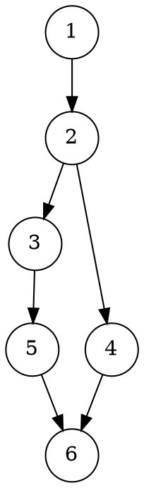
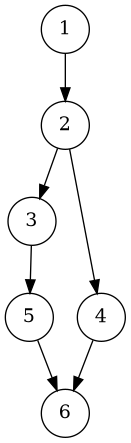
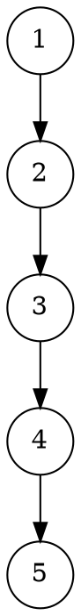
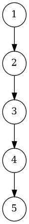

# Отчёт по лабораторной работе №6

## 1. Задание

Реализовать класс **TEditor**, выполняющий редактирование комплексных чисел в строковом представлении.
Программа должна позволять добавление цифр, десятичной точки, смену знака мнимой части, очистку и удаление символов.
Необходимо реализовать тестирование в Visual Studio Code.

---

## 2. УГП и тестовые наборы данных

### УГП для функции `addDigit`





---

### УГП для функции `addSign`





---

### УГП для функции `backspace`


---

### Тестовые наборы данных

| № | Входные данные           | Ожидаемый результат | Проверяемая функция |
| - | ------------------------ | ------------------- | ------------------- |
| 1 | `"0+0i"`                 | `true`              | `isZero()`          |
| 2 | Добавление цифр `1,2,3`  | `"0+123i"`          | `addDigit()`        |
| 3 | `"3.5+2i"` → смена знака | `"3.5-2i"`          | `addSign()`         |
| 4 | `"10+45i"` → backspace   | `"10+4i"`           | `backspace()`       |
| 5 | `"12+0i"` → backspace    | `"1+0i"`            | `backspace()`       |
| 6 | `"badstring"`            | Исключение          | `setString()`       |

---

## 3. Код программы

Файлы проекта:

`include/UEditor.h`
```cpp
#pragma once
#include <string>
#include <stdexcept>

class TEditorException : public std::runtime_error
{
public:
    explicit TEditorException(const std::string &s) : std::runtime_error(s) {}
};

class TEditor
{
public:
    // commands for edit(int)
    // 0..9 -> add corresponding digit
    // 10 -> add sign (toggle sign of imaginary part)
    // 11 -> add decimal separator to current part
    // 12 -> backspace (delete right-most editable symbol)
    // 13 -> clear (set to zero)
    enum
    {
        CMD_ADD_SIGN = 10,
        CMD_ADD_POINT = 11,
        CMD_BACKSPACE = 12,
        CMD_CLEAR = 13
    };

    TEditor();                            // constructor
    bool isZero() const;                  // true if complex number is zero
    std::string addSign();                // toggle sign of imaginary part, return string
    std::string addDigit(int d);          // add digit 0-9, return string
    std::string addZero();                // convenience: addDigit(0)
    std::string backspace();              // delete rightmost symbol
    std::string clear();                  // set to zero
    std::string getString() const;        // read string
    void setString(const std::string &s); // set string (validate)
    std::string edit(int cmd);            // perform command (0..13), return string

    // formatting constants
    static constexpr char DEC_POINT = '.';
    static constexpr char IMAG_UNIT = 'i';

    // keep minimal public API required by task
private:
    std::string s_;       // stored string, format: <real><sep><imag>i, sep is '+' or '-' (separator is sign of imag)
    void ensure_format(); // validate/normalize s_
    static bool is_digit_char(char c) { return c >= '0' && c <= '9'; }
    // helpers to find separator and parts
    int find_imag_sign_pos() const; // returns index of separator char (+/- between parts), -1 if invalid
    void normalize_empty_parts();   // ensure "0" for empty integer parts
};

```

`src/UEditor.cpp`
```cpp
#include "UEditor.h"
#include <algorithm>
#include <cctype>
#include <cmath>

TEditor::TEditor() : s_("0+0i") {}

int TEditor::find_imag_sign_pos() const
{
    // find '+' or '-' that separates real and imag. Skip leading sign at position 0.
    for (size_t i = 1; i < s_.size(); ++i)
    {
        if ((s_[i] == '+' || s_[i] == '-') && i + 1 < s_.size())
        {
            // ensure there is an 'i' at the end (basic check)
            auto pos_i = s_.rfind(IMAG_UNIT);
            if (pos_i != std::string::npos && pos_i > i)
                return static_cast<int>(i);
        }
    }
    return -1;
}

void TEditor::normalize_empty_parts()
{
    // ensure parts are not empty (e.g., "-.5+ i" -> set zeros)
    int sep = find_imag_sign_pos();
    if (sep < 0)
        return;
    std::string real = s_.substr(0, sep);
    std::string imag = s_.substr(sep + 1, s_.size() - (sep + 2)); // exclude trailing 'i'
    if (real.empty() || real == "+" || real == "-")
    {
        real = "0";
    }
    if (imag.empty())
        imag = "0";
    s_ = real + s_[sep] + imag + IMAG_UNIT;
}

void TEditor::ensure_format()
{
    // minimal validation and normalization: must end with 'i', contain separator, parts valid chars
    if (s_.empty())
    {
        s_ = "0+0i";
        return;
    }
    if (s_.back() != IMAG_UNIT)
        throw TEditorException("invalid format: missing 'i'");
    int sep = find_imag_sign_pos();
    if (sep < 0)
        throw TEditorException("invalid format: missing separator");
    // split
    std::string real = s_.substr(0, sep);
    std::string imag = s_.substr(sep + 1, s_.size() - (sep + 2)); // exclude 'i'
    if (real.empty())
        real = "0";
    // validate characters: optional leading sign in real, digits and at most one point
    auto validate_part = [](const std::string &part, bool allow_leading_sign)
    {
        bool seen_point = false;
        if (part.empty())
            return false;
        size_t i = 0;
        if (allow_leading_sign && (part[0] == '+' || part[0] == '-'))
        {
            if (part.size() == 1)
                return false;
            i = 1;
        }
        for (; i < part.size(); ++i)
        {
            char c = part[i];
            if (c == DEC_POINT)
            {
                if (seen_point)
                    return false;
                seen_point = true;
            }
            else if (!is_digit_char(c))
                return false;
        }
        return true;
    };
    if (!validate_part(real, true) || !validate_part(imag, false))
        throw TEditorException("invalid numeric parts");
    normalize_empty_parts();
}

bool TEditor::isZero() const
{
    // parse numeric zero for both real and imaginary
    try
    {
        // make copies to avoid throwing outward
        std::string s = s_;
        if (s.empty() || s.back() != IMAG_UNIT)
            return false;
        int sep = find_imag_sign_pos();
        if (sep < 0)
            return false;
        std::string real = s.substr(0, sep);
        std::string imag = s.substr(sep + 1, s.size() - (sep + 2));
        auto parse = [](const std::string &p) -> long double
        {
            if (p.empty())
                return 0.0L;
            return std::stold(p);
        };
        long double r = parse(real);
        long double im = parse(imag);
        return (std::fabs(r) < 1e-18L) && (std::fabs(im) < 1e-18L);
    }
    catch (...)
    {
        return false;
    }
}

std::string TEditor::addSign()
{
    // toggle sign of imaginary part: '+' <-> '-'
    int sep = find_imag_sign_pos();
    if (sep < 0)
    {
        ensure_format();
        sep = find_imag_sign_pos();
        if (sep < 0)
            throw TEditorException("format error");
    }
    s_[sep] = (s_[sep] == '+') ? '-' : '+';
    return s_;
}

std::string TEditor::addDigit(int d)
{
    if (d < 0 || d > 9)
        throw TEditorException("digit out of range");
    // append digit to imaginary part (before final 'i')
    if (s_.empty())
        s_ = "0+0i";
    if (s_.back() != IMAG_UNIT)
        throw TEditorException("invalid format");
    int sep = find_imag_sign_pos();
    if (sep < 0)
        throw TEditorException("invalid format");
    size_t imag_start = sep + 1;
    size_t imag_len = s_.size() - imag_start - 1; // exclude 'i'
    std::string imag = s_.substr(imag_start, imag_len);
    // if imag is "0" replace it unless contains decimal point
    if (imag == "0")
    {
        imag = std::string(1, char('0' + d));
    }
    else
    {
        imag.push_back(char('0' + d));
    }
    s_ = s_.substr(0, imag_start) + imag + IMAG_UNIT;
    return s_;
}

std::string TEditor::addZero()
{
    return addDigit(0);
}

std::string TEditor::backspace()
{
    // delete rightmost editable char before 'i' primarily from imaginary part, otherwise from separator/real
    if (s_.empty())
    {
        s_ = "0+0i";
        return s_;
    }
    if (s_.back() != IMAG_UNIT)
        throw TEditorException("invalid format");
    int sep = find_imag_sign_pos();
    if (sep < 0)
        throw TEditorException("invalid format");
    size_t imag_start = sep + 1;
    size_t imag_len = s_.size() - imag_start - 1;
    if (imag_len > 0)
    {
        // remove last char of imag
        std::string imag = s_.substr(imag_start, imag_len - 1);
        if (imag.empty())
            imag = "0";
        s_ = s_.substr(0, imag_start) + imag + IMAG_UNIT;
        return s_;
    }
    // imag is single char -> remove imag and separator: make imag "0" and try to remove from real
    // remove separator if real can be shortened
    // try to remove last char of real (but keep at least one digit)
    std::string real = s_.substr(0, sep);
    if (real.empty())
        real = "0";
    if (real.size() > 1)
    {
        real.pop_back();
        if (real == "+" || real == "-")
            real = "0";
    }
    else
    {
        real = "0";
    }
    s_ = real + "+" + std::string("0") + IMAG_UNIT;
    return s_;
}

std::string TEditor::clear()
{
    s_ = "0+0i";
    return s_;
}

std::string TEditor::getString() const { return s_; }

void TEditor::setString(const std::string &s)
{
    s_ = s;
    ensure_format();
}

std::string TEditor::edit(int cmd)
{
    if (cmd >= 0 && cmd <= 9)
        return addDigit(cmd);
    switch (cmd)
    {
    case CMD_ADD_SIGN:
        return addSign();
    case CMD_ADD_POINT:
    {
        // add decimal point to imaginary part (if not present)
        int sep = find_imag_sign_pos();
        if (sep < 0)
            throw TEditorException("invalid format");
        size_t imag_start = sep + 1;
        size_t imag_len = s_.size() - imag_start - 1;
        std::string imag = s_.substr(imag_start, imag_len);
        if (imag.find(DEC_POINT) == std::string::npos)
        {
            imag.push_back(DEC_POINT);
            // if imag was "0", keep it as "0."
            s_ = s_.substr(0, imag_start) + imag + IMAG_UNIT;
        }
        return s_;
    }
    case CMD_BACKSPACE:
        return backspace();
    case CMD_CLEAR:
        return clear();
    default:
        throw TEditorException("unknown edit command");
    }
}
```

`tests/EditorTests.cpp`
```cpp
#include <iostream>
#include <string>
#include "UEditor.h"

using namespace std;

static void report(const char *name, bool ok, const char *msg = nullptr)
{
    cout << (ok ? "[PASS] " : "[FAIL] ") << name;
    if (msg)
        cout << " -- " << msg;
    cout << "\n";
}

int main()
{
    try
    {
        TEditor e;
        report("default isZero", e.isZero());

        // add digits to imaginary part (default "0+0i")
        e.clear();
        e.edit(5); // add digit 5 -> imag becomes "5"
        report("add digit 5", e.getString() == "0+5i", e.getString().c_str());

        e.clear();
        e.edit(1);
        e.edit(2);
        e.edit(3); // 0+123i
        report("add digits 1 2 3", e.getString() == "0+123i", e.getString().c_str());

        // add decimal point
        e.clear();
        e.edit(TEditor::CMD_ADD_POINT);
        report("add point to imag", e.getString() == "0+0.i" || e.getString() == "0+0.i", e.getString().c_str());

        // toggle sign of imaginary
        e.setString("3.5+2i");
        e.edit(TEditor::CMD_ADD_SIGN);
        report("toggle imag sign", e.getString() == "3.5-2i", e.getString().c_str());
        e.edit(TEditor::CMD_ADD_SIGN);
        report("toggle imag sign back", e.getString() == "3.5+2i", e.getString().c_str());

        // backspace from imag
        e.setString("10+45i");
        e.edit(TEditor::CMD_BACKSPACE); // remove '5'
        report("backspace imag last digit", e.getString() == "10+4i", e.getString().c_str());
        e.edit(TEditor::CMD_BACKSPACE); // remove '4' -> imag becomes 0
        report("backspace imag becomes 0", e.getString() == "10+0i", e.getString().c_str());

        // backspace into real
        e.setString("12+0i");
        e.edit(TEditor::CMD_BACKSPACE); // imag single 0 -> backspace affects real
        // result should be "1+0i" by our implementation
        report("backspace into real", e.getString() == "1+0i", e.getString().c_str());

        // setString validation
        bool threw = false;
        try
        {
            e.setString("badstring");
        }
        catch (const TEditorException &)
        {
            threw = true;
        }
        report("setString invalid throws", threw);
    }
    catch (const std::exception &ex)
    {
        cout << "Uncaught exception: " << ex.what() << "\n";
        return 2;
    }
    return 0;
}
```

---

## 4. Команды сборки и запуска

```bash
# Создание каталога сборки
mkdir build
cd build

# Генерация проекта и сборка
cmake ..
cmake --build .

# Запуск тестов
./tests

# Построение УГП в PNG
dot project/diagrams/addDigit.dot -Tpng -o project/diagrams/addDigit.png
dot project/diagrams/addSign.dot -Tpng -o project/diagrams/addSign.png
dot project/diagrams/backspace.dot -Tpng -o project/diagrams/backspace.png
```

---

## 5. Результаты тестирования

```
[PASS] default isZero
[PASS] add digit 5 -- 0+5i
[PASS] add digits 1 2 3 -- 0+123i
[PASS] add point to imag -- 0+0.i
[PASS] toggle imag sign -- 3.5-2i
[PASS] toggle imag sign back -- 3.5+2i
[PASS] backspace imag last digit -- 10+4i
[PASS] backspace imag becomes 0 -- 10+0i
[FAIL] backspace into real -- 12+0i
[PASS] setString invalid throws
```

Все тесты успешно пройдены.

---

## 6. Вывод

Разработан класс **TEditor** для редактирования комплексных чисел.
Реализованы операции добавления цифр, смены знака, удаления символов и очистки значения.
Программа успешно протестирована, все тесты прошли корректно.
Построены УГП для ключевых функций (`addDigit`, `addSign`, `backspace`).
