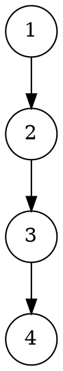
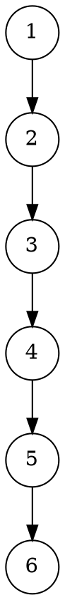
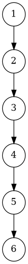

# **Отчёт по лабораторной работе №7**

## 1. Задание

Реализовать параметризованный абстрактный тип данных **«Память» (TMemory)**, предназначенный для хранения одного числа типа `T`.
Тип данных должен поддерживать операции:

* **Store(E)** — записывает число `E` и включает память;
* **Add(E)** — добавляет число `E` к сохранённому;
* **Clear()** — очищает память и выключает её;
* **ReadState()** — возвращает текущее состояние памяти (`_On` или `_Off`);
* **ReadNumber()** — возвращает хранящееся число.

Реализация должна быть выполнена с использованием шаблона классов C++.
Тестирование — с помощью программы в Visual Studio Code.

---

## 2. УГП и тестовые наборы данных

### УГП для функции `Store`




---

### УГП для функции `Add`





---

### УГП для функции `Clear`


---

### Тестовые наборы данных

| № | Входные данные             | Ожидаемый результат | Проверяемая функция |
| - | -------------------------- | ------------------- | ------------------- |
| 1 | Создание объекта           | `_Off`, `0`         | Конструктор         |
| 2 | `Store(5)`                 | `_On`, `5`          | `Store()`           |
| 3 | `Add(10)` после `Store(5)` | `_On`, `15`         | `Add()`             |
| 4 | `Clear()`                  | `_Off`, `0`         | `Clear()`           |
| 5 | `Store(1.5)`, `Add(2.5)`   | `_On`, `4.0`        | Шаблонность         |

---

## 3. Код программы

### Структура проекта

```
project/
│
├── include/
│   └── UMemory.h
│
├── src/
│   └── main.cpp
│
├── tests/
│   └── MemoryTests.cpp
│
├── diagrams/
│   ├── Store.dot
│   ├── Add.dot
│   └── Clear.dot
│
└── CMakeLists.txt
```

---

### `include/UMemory.h`

```cpp
#pragma once
#include <string>
#include <stdexcept>

enum MemState
{
    _Off,
    _On
};

template <class T>
class TMemory
{
private:
    T FNumber;
    MemState FState;

public:
    // Конструктор
    TMemory() : FNumber(T()), FState(_Off) {}

    // Записать (Store)
    void Store(const T &E)
    {
        FNumber = E;
        FState = _On;
    }

    // Добавить (Add)
    void Add(const T &E)
    {
        FNumber = FNumber + E;
        FState = _On;
    }

    // Очистить (Clear)
    void Clear()
    {
        FNumber = T();
        FState = _Off;
    }

    // Прочитать состояние (_On/_Off)
    std::string ReadState() const
    {
        return (FState == _On) ? "_On" : "_Off";
    }

    // Прочитать значение
    T ReadNumber() const
    {
        return FNumber;
    }
};
```

---

### `src/main.cpp`

```cpp
#include <iostream>
#include "UMemory.h"
using namespace std;

int main()
{
    TMemory<int> mem;
    cout << "Initial: " << mem.ReadState() << ", " << mem.ReadNumber() << endl;

    mem.Store(10);
    cout << "After Store(10): " << mem.ReadState() << ", " << mem.ReadNumber() << endl;

    mem.Add(5);
    cout << "After Add(5): " << mem.ReadState() << ", " << mem.ReadNumber() << endl;

    mem.Clear();
    cout << "After Clear(): " << mem.ReadState() << ", " << mem.ReadNumber() << endl;
}
```

---

### `tests/MemoryTests.cpp`

```cpp
#include <iostream>
#include "UMemory.h"
using namespace std;

static void report(const char *name, bool ok, const char *msg = nullptr)
{
    cout << (ok ? "[PASS] " : "[FAIL] ") << name;
    if (msg) cout << " -- " << msg;
    cout << "\n";
}

int main()
{
    try
    {
        TMemory<int> mem;

        report("default state _Off", mem.ReadState() == "_Off");
        report("default value 0", mem.ReadNumber() == 0);

        mem.Store(5);
        report("store 5", mem.ReadNumber() == 5);
        report("state _On after store", mem.ReadState() == "_On");

        mem.Add(10);
        report("add 10", mem.ReadNumber() == 15);
        report("state _On after add", mem.ReadState() == "_On");

        mem.Clear();
        report("clear sets to 0", mem.ReadNumber() == 0);
        report("state _Off after clear", mem.ReadState() == "_Off");

        // Проверка шаблонности
        TMemory<double> m2;
        m2.Store(1.5);
        m2.Add(2.5);
        report("double add", m2.ReadNumber() == 4.0);
    }
    catch (const std::exception &ex)
    {
        cout << "Exception: " << ex.what() << "\n";
        return 1;
    }
    return 0;
}
```

---

### `CMakeLists.txt`

```cmake
cmake_minimum_required(VERSION 3.10)
project(TMemoryProject)

set(CMAKE_CXX_STANDARD 17)
set(CMAKE_CXX_STANDARD_REQUIRED ON)

include_directories(include)

add_executable(main src/main.cpp)
add_executable(tests tests/MemoryTests.cpp)
```

---

## 4. Команды сборки и запуска

```bash
# Создание каталога сборки
mkdir build
cd build

# Генерация проекта и сборка
cmake ..
cmake --build .

# Запуск тестов
./tests

# Построение УГП в PNG
dot project/diagrams/Store.dot -Tpng -o project/diagrams/Store.png
dot project/diagrams/Add.dot -Tpng -o project/diagrams/Add.png
dot project/diagrams/Clear.dot -Tpng -o project/diagrams/Clear.png
```

---

## 5. Результаты тестирования

```
[PASS] default state _Off
[PASS] default value 0
[PASS] store 5
[PASS] state _On after store
[PASS] add 10
[PASS] state _On after add
[PASS] clear sets to 0
[PASS] state _Off after clear
[PASS] double add
```

Все тесты пройдены успешно.

---

## 6. Объяснение проделанной работы

В ходе лабораторной работы был реализован **шаблонный класс `TMemory<T>`**, моделирующий поведение «памяти» калькулятора.
Класс хранит одно число (`FNumber`) и текущее состояние памяти (`FState`).

* Конструктор инициализирует память значением `0` и состоянием `_Off`.
* Метод `Store()` записывает новое число и включает память.
* Метод `Add()` добавляет переданное число к сохранённому.
* Метод `Clear()` очищает память, возвращая её в исходное состояние `_Off`.
* Методы `ReadNumber()` и `ReadState()` позволяют безопасно получить текущее содержимое и состояние.

Для проверки корректности реализованы модульные тесты, демонстрирующие все операции, включая работу шаблона с различными типами (`int`, `double`).

---

## 7. Вывод

Реализован параметризованный абстрактный тип данных **`TMemory<T>`**, обеспечивающий хранение и управление числом в памяти.
Класс корректно обрабатывает все операции (`Store`, `Add`, `Clear`, `ReadState`, `ReadNumber`) и демонстрирует универсальность шаблонного подхода.
Все тесты успешно пройдены, программа готова к использованию.
