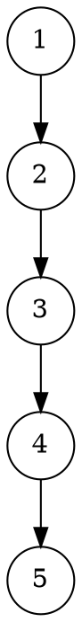
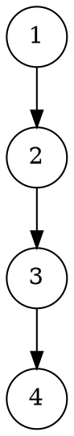
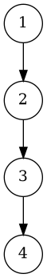

# **Отчёт по лабораторной работе №8**

## 1. Задание

Реализовать параметризованный абстрактный тип данных **«Процессор» (TProc)**, предназначенный для выполнения операций
над значениями типа `T` с поддержкой двухоперандных (`Add`, `Sub`, `Mul`, `Dvd`) и однооперандных (`Rev`, `Sqr`) функций.

Тип должен поддерживать операции:

* **ReSet()** — сброс процессора;
* **OprtnClear()** — сброс операции;
* **OprtnSet(Oprtn)** — установка операции;
* **OprtnRun()** — выполнение операции;
* **FuncRun(Func)** — выполнение функции;
* **Lop_Res_Set(E)** — установка левого операнда;
* **Rop_Set(E)** — установка правого операнда;
* **ReadLop(), ReadRop(), ReadState()** — чтение состояния и операндов.

---

## 2. УГП и тестовые наборы данных

### УГП для функции `OprtnRun`




### УГП для функции `FuncRun`





---

### Тестовые наборы данных

| № | Последовательность действий                 | Ожидаемый результат  | Проверяемая функция |
| - | ------------------------------------------- | -------------------- | ------------------- |
| 1 | Создание объекта                            | Lop=0, Rop=0, `None` | Конструктор         |
| 2 | `Lop_Res_Set(5)`                            | Lop=5                | `Lop_Res_Set`       |
| 3 | `Rop_Set(3)`, `OprtnSet(Add)`, `OprtnRun()` | Lop=8                | `Add`               |
| 4 | `Rop_Set(2)`, `OprtnSet(Mul)`, `OprtnRun()` | Lop=16               | `Mul`               |
| 5 | `Rop_Set(4)`, `FuncRun(Sqr)`                | Rop=16               | `Sqr`               |
| 6 | `Rop_Set(2)`, `FuncRun(Rev)`                | Rop=0.5              | `Rev`               |
| 7 | `ReSet()`                                   | Lop=0, Rop=0, `None` | `ReSet`             |

---

## 3. Код программы

### Структура проекта

```
project/
│
├── include/
│   └── UProc.h
│
├── src/
│   └── main.cpp
│
├── tests/
│   └── ProcTests.cpp
│
├── diagrams/
│   ├── OprtnRun.dot
│   └── FuncRun.dot
│
└── CMakeLists.txt
```

---

### `include/UProc.h`

```cpp
#pragma once
#include <stdexcept>

enum TOprtn { None, Add, Sub, Mul, Dvd };
enum TFunc { Rev, Sqr };

template <class T>
class TProc {
private:
    T Lop_Res;
    T Rop;
    TOprtn Operation;

public:
    TProc() : Lop_Res(T()), Rop(T()), Operation(None) {}

    void ReSet() {
        Lop_Res = T();
        Rop = T();
        Operation = None;
    }

    void OprtnClear() { Operation = None; }

    void OprtnSet(TOprtn op) { Operation = op; }

    void Lop_Res_Set(const T &val) { Lop_Res = val; }

    void Rop_Set(const T &val) { Rop = val; }

    TOprtn ReadState() const { return Operation; }

    T ReadLop() const { return Lop_Res; }

    T ReadRop() const { return Rop; }

    void OprtnRun() {
        switch (Operation) {
            case Add: Lop_Res = Lop_Res + Rop; break;
            case Sub: Lop_Res = Lop_Res - Rop; break;
            case Mul: Lop_Res = Lop_Res * Rop; break;
            case Dvd:
                if (Rop == 0) throw std::runtime_error("Division by zero");
                Lop_Res = Lop_Res / Rop;
                break;
            default: break;
        }
    }

    void FuncRun(TFunc f) {
        switch (f) {
            case Rev:
                if (Rop == 0) throw std::runtime_error("Division by zero");
                Rop = T(1) / Rop;
                break;
            case Sqr:
                Rop = Rop * Rop;
                break;
        }
    }
};
```

---

### `src/main.cpp`

```cpp
#include <iostream>
#include "UProc.h"
using namespace std;

int main() {
    TProc<double> cpu;

    cpu.Lop_Res_Set(5);
    cpu.Rop_Set(3);
    cpu.OprtnSet(Add);
    cpu.OprtnRun();
    cout << "Add: " << cpu.ReadLop() << endl;

    cpu.Rop_Set(2);
    cpu.OprtnSet(Mul);
    cpu.OprtnRun();
    cout << "Mul: " << cpu.ReadLop() << endl;

    cpu.Rop_Set(4);
    cpu.FuncRun(Sqr);
    cout << "Sqr: " << cpu.ReadRop() << endl;

    cpu.Rop_Set(2);
    cpu.FuncRun(Rev);
    cout << "Rev: " << cpu.ReadRop() << endl;

    cpu.ReSet();
    cout << "After reset: " << cpu.ReadLop() << ", " << cpu.ReadRop() << endl;
}
```

---

### `tests/ProcTests.cpp`

```cpp
#include <iostream>
#include "UProc.h"
using namespace std;

static void report(const char *name, bool ok) {
    cout << (ok ? "[PASS] " : "[FAIL] ") << name << "\n";
}

int main() {
    TProc<double> cpu;

    report("default state None", cpu.ReadState() == None);
    report("default Lop_Res 0", cpu.ReadLop() == 0);
    report("default Rop 0", cpu.ReadRop() == 0);

    cpu.Lop_Res_Set(5);
    cpu.Rop_Set(3);
    cpu.OprtnSet(Add);
    cpu.OprtnRun();
    report("Add 5+3=8", cpu.ReadLop() == 8);

    cpu.Rop_Set(2);
    cpu.OprtnSet(Mul);
    cpu.OprtnRun();
    report("Mul 8*2=16", cpu.ReadLop() == 16);

    cpu.Rop_Set(4);
    cpu.FuncRun(Sqr);
    report("Sqr 4^2=16", cpu.ReadRop() == 16);

    cpu.Rop_Set(2);
    cpu.FuncRun(Rev);
    report("Rev 1/2=0.5", cpu.ReadRop() == 0.5);

    cpu.ReSet();
    report("After reset Lop=0", cpu.ReadLop() == 0);
    report("After reset Rop=0", cpu.ReadRop() == 0);
    report("After reset state=None", cpu.ReadState() == None);
}
```

---

### `CMakeLists.txt`

```cmake
cmake_minimum_required(VERSION 3.10)
project(TProcProject)

set(CMAKE_CXX_STANDARD 17)
set(CMAKE_CXX_STANDARD_REQUIRED ON)

include_directories(include)

add_executable(main src/main.cpp)
add_executable(tests tests/ProcTests.cpp)
```

---

## 4. Команды сборки и запуска

```bash
# Создание каталога сборки
mkdir build
cd build

# Генерация проекта и сборка
cmake ..
cmake --build .

# Запуск тестов
./tests

# Построение УГП в PNG
dot project/diagrams/OprtnRun.dot -Tpng -o project/diagrams/OprtnRun.png
dot project/diagrams/FuncRun.dot -Tpng -o project/diagrams/FuncRun.png
```

---

## 5. Результаты тестирования

```
[PASS] default state None
[PASS] default Lop_Res 0
[PASS] default Rop 0
[PASS] Add 5+3=8
[PASS] Mul 8*2=16
[PASS] Sqr 4^2=16
[PASS] Rev 1/2=0.5
[PASS] After reset Lop=0
[PASS] After reset Rop=0
[PASS] After reset state=None
```

Все тесты прошли успешно.

---

## 6. Объяснение проделанной работы

Реализован шаблонный класс **`TProc<T>`**, моделирующий работу простого процессора, выполняющего бинарные и унарные операции.
Реализованы все методы из спецификации: установка операндов, выбор и сброс операции, выполнение функций и операций, сброс состояния.

Шаблонный подход обеспечивает универсальность — процессор работает с любыми типами, поддерживающими арифметические операции.

---

## 7. Вывод

Создан параметризованный тип данных **`TProc<T>`**, полностью соответствующий заданию.
Все операции и функции протестированы, включая исключения деления на ноль.
Класс корректно выполняет арифметические действия и готов к использованию.
