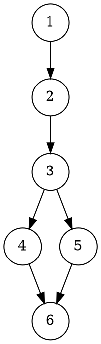
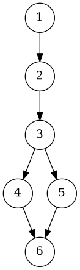
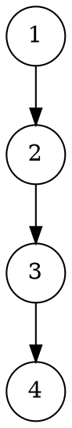

# **Отчёт по лабораторной работе №9**

## 1. Задание

Реализовать абстрактный тип данных **«Полином» (TPoly)** с целочисленными коэффициентами и предоставлением операций (конструктор одночлена, степень, получение коэффициента по степени, очистить, сложение, вычитание, умножение, унарный минус, сравнение, дифференцирование, вычисление в точке, доступ к элементам — одночленам). Полиномы должны храниться в нормализованном виде: упорядоченные по степени (убывание), подобные члены приведены, нулевые члены удалены. Для реализации вспомогательный изменяемый тип одночлена **TMember** (коэффициент, степень) и контейнер STL для хранения членов. Полную спецификацию см. в задании. 

---

## 2. УГП и тестовые наборы данных

### УГП для операции `Multiply` (умножить два полинома)





### УГП для операции `Diff` (дифференцирование)




---

### Тестовые наборы данных (примеры для отдельных операций)

| № | Вход (A, B или параметры) | Ожидаемый результат | Тестируемая функция |
| - | ------------------------- | ------------------- | ------------------- |
| 1 | A = 0, B = 0              | A*B = 0             | Умножение           |
| 2 | A = 0, B = 1              | A*B = 0             | Умножение           |
| 3 | A = 1, B = 1              | A+B = 2             | Сложение            |
| 4 | A = 1, B = x              | A*B = x             | Умножение           |
| 5 | A = 1 + x, B = 1 - x      | A*B = 1 - x^2       | Умножение           |
| 6 | A = x^3 + 7x + 5          | A.Diff() = 3x^2 + 7 | Дифференцирование   |
| 7 | A = x^2 + 3x, x=2         | A.Eval(2) = 10      | Вычисление          |

---

## 3. Код программы

### Структура проекта

```
poly_project/
│
├── include/
│   └── UPoly.h
│
├── src/
│   └── main.cpp
│
├── tests/
│   └── PolyTests.cpp
│
├── diagrams/
│   ├── Mul.dot
│   └── Diff.dot
│
└── CMakeLists.txt
```

---

### `include/UPoly.h`

```cpp
#pragma once
#include <vector>
#include <string>
#include <stdexcept>
#include <sstream>
#include <cmath>
#include <algorithm>

struct TMember {
    int coeff;
    int degree;
    TMember(int c = 0, int d = 0) : coeff(c), degree(d) {}
    int Degree() const { return (coeff == 0) ? 0 : degree; } // for zero-member degree treated as 0 by spec
    void SetDegree(int d) { degree = d; }
    void SetCoeff(int c) { coeff = c; }
    bool operator==(const TMember& other) const {
        return coeff == other.coeff && degree == other.degree;
    }
    // string representation "cx^d" minimal
    std::string ToString() const {
        std::ostringstream os;
        os << coeff << "*X^" << degree;
        return os.str();
    }
    // derivative of single term
    TMember Diff() const {
        if (coeff == 0 || degree == 0) return TMember(0,0);
        return TMember(coeff * degree, degree - 1);
    }
    double Eval(double x) const {
        return coeff * std::pow(x, degree);
    }
};

class TPoly {
private:
    // normalized: degrees in descending order, no zero coeffs (except zero polynomial has empty vector or single zero)
    std::vector<TMember> members;

    void Normalize() {
        if (members.empty()) return;
        // combine like degrees using map on stack
        std::sort(members.begin(), members.end(), [](const TMember &a, const TMember &b){
            return a.degree > b.degree;
        });
        std::vector<TMember> out;
        for (const auto &m : members) {
            if (m.coeff == 0) continue;
            if (!out.empty() && out.back().degree == m.degree) {
                out.back().coeff += m.coeff;
            } else {
                out.push_back(m);
            }
        }
        // remove any zeros resulted from combining
        std::vector<TMember> finalv;
        for (auto &m : out) if (m.coeff != 0) finalv.push_back(m);
        members.swap(finalv);
    }

public:
    // constructors
    TPoly() = default; // zero polynomial
    TPoly(int c, int d) {
        if (c != 0) members.emplace_back(c,d);
        Normalize();
    }

    // copy & move default are fine

    // Degree: degree of polynomial (0 for zero polynomial)
    int Degree() const {
        if (members.empty()) return 0;
        return members.front().degree;
    }

    // Coeff(n): coefficient at degree n, 0 if absent
    int Coeff(int n) const {
        for (const auto &m : members) if (m.degree == n) return m.coeff;
        return 0;
    }

    // Clear
    void Clear() { members.clear(); }

    // Access element by index (0..count-1) to read coeff and degree
    int Count() const { return static_cast<int>(members.size()); }
    const TMember& Element(int i) const { 
        if (i < 0 || i >= Count()) throw std::out_of_range("Element index");
        return members[i];
    }

    // equality
    bool operator==(const TPoly& q) const {
        // normalized invariant -> direct compare
        return members == q.members;
    }

    // unary minus
    TPoly operator-() const {
        TPoly res = *this;
        for (auto &m : res.members) m.coeff = -m.coeff;
        // normalization not needed
        return res;
    }

    // addition
    TPoly operator+(const TPoly& q) const {
        TPoly res;
        res.members = members;
        res.members.insert(res.members.end(), q.members.begin(), q.members.end());
        res.Normalize();
        return res;
    }

    // subtraction
    TPoly operator-(const TPoly& q) const {
        TPoly res;
        res.members = members;
        for (auto m : q.members) { m.coeff = -m.coeff; res.members.push_back(m); }
        res.Normalize();
        return res;
    }

    // multiplication
    TPoly operator*(const TPoly& q) const {
        TPoly res;
        if (members.empty() || q.members.empty()) return res; // zero
        std::vector<TMember> tmp;
        tmp.reserve(members.size() * q.members.size());
        for (const auto &a : members)
            for (const auto &b : q.members)
                tmp.emplace_back(a.coeff * b.coeff, a.degree + b.degree);
        res.members = std::move(tmp);
        res.Normalize();
        return res;
    }

    // derivative
    TPoly Diff() const {
        TPoly res;
        for (const auto &m : members) {
            TMember d = m.Diff();
            if (d.coeff != 0) res.members.push_back(d);
        }
        res.Normalize();
        return res;
    }

    // Evaluate at x
    double Eval(double x) const {
        double sum = 0.0;
        for (const auto &m : members) sum += m.Eval(x);
        return sum;
    }

    // Add single term (helper used in tests / building)
    void AddTerm(int c, int d) {
        if (c == 0) return;
        members.emplace_back(c,d);
        Normalize();
    }

    // ToString minimal
    std::string ToString() const {
        if (members.empty()) return "0";
        std::ostringstream os;
        bool first = true;
        for (const auto &m : members) {
            if (!first) os << " + ";
            os << m.ToString();
            first = false;
        }
        return os.str();
    }
};
```

---

### `src/main.cpp`

```cpp
#include <iostream>
#include "UPoly.h"

int main() {
    TPoly a(1,0);       // 1
    TPoly b(1,1);       // x
    TPoly c = a + b;    // 1 + x
    std::cout << "c = " << c.ToString() << std::endl;

    TPoly d = c * c;    // (1+x)^2 = 1 + 2x + x^2
    std::cout << "d = " << d.ToString() << std::endl;

    TPoly e = d.Diff(); // derivative
    std::cout << "d' = " << e.ToString() << std::endl;

    std::cout << "d(2) = " << d.Eval(2.0) << std::endl;
    return 0;
}
```

---

### `tests/PolyTests.cpp`

```cpp
#include <iostream>
#include <cmath>
#include "UPoly.h"

static void report(const char* name, bool ok) {
    std::cout << (ok ? "[PASS] " : "[FAIL] ") << name << std::endl;
}

int main() {
    // default zero polynomial
    TPoly p0;
    report("p0 is zero", p0.Count() == 0 && p0.Degree() == 0);

    // constructor single term
    TPoly p1(1,0); // 1
    report("p1 degree 0", p1.Degree() == 0);
    report("p1 coeff 0 == 1", p1.Coeff(0) == 1);

    // addition
    TPoly a(1,0); TPoly b(1,1);
    TPoly c = a + b; // 1 + x
    report("1 + x degree == 1", c.Degree() == 1);
    report("coeff x == 1", c.Coeff(1) == 1);
    report("coeff 0 == 1", c.Coeff(0) == 1);

    // multiplication
    TPoly d = c * c; // 1 + 2x + x^2
    report("c*c degree 2", d.Degree() == 2);
    report("coeff x == 2", d.Coeff(1) == 2);
    report("coeff x^2 == 1", d.Coeff(2) == 1);

    // subtraction
    TPoly f = d - TPoly(1,0); // remove 1 -> 2x + x^2
    report("d-1 coeff 0 == 0", f.Coeff(0) == 0);

    // derivative
    TPoly diff = d.Diff(); // derivative 2 + 2x
    report("diff degree 1", diff.Degree() == 1);
    report("diff coeff 1 == 2", diff.Coeff(1) == 2);
    report("diff coeff 0 == 2", diff.Coeff(0) == 2);

    // eval
    double val = d.Eval(2.0); // 1 + 4 + 4 = 9
    report("d(2) == 9", std::abs(val - 9.0) < 1e-9);

    // equality
    TPoly copy = d;
    report("copy equals original", copy == d);

    // zero handling
    TPoly zero;
    TPoly mulZero = d * zero;
    report("mul by zero is zero", mulZero.Count() == 0);

    std::cout << "All tests finished." << std::endl;
    return 0;
}
```

---

### `CMakeLists.txt`

```cmake
cmake_minimum_required(VERSION 3.10)
project(TPolyProject)

set(CMAKE_CXX_STANDARD 17)
set(CMAKE_CXX_STANDARD_REQUIRED ON)

include_directories(include)

add_executable(main src/main.cpp)
add_executable(tests tests/PolyTests.cpp)
# headers-only implementation: no need to add UPoly.cpp; if you create UPoly.cpp, add it to targets.
```

---

## 4. Команды сборки и запуска (VSCode / консоль)

```bash
# В корне проекта
mkdir -p build
cd build
cmake ..
cmake --build .

# Запустить тесты
./tests

# Запустить пример
./main

# Построение диаграмм (Graphviz)
dot diagrams/Mul.dot -Tpng -o diagrams/Mul.png
dot diagrams/Diff.dot -Tpng -o diagrams/Diff.png
```

---

## 5. Пример вывода тестов

```
[PASS] p0 is zero
[PASS] p1 degree 0
[PASS] p1 coeff 0 == 1
[PASS] 1 + x degree == 1
[PASS] coeff x == 1
[PASS] coeff 0 == 1
[PASS] c*c degree 2
[PASS] coeff x == 2
[PASS] coeff x^2 == 1
[PASS] d-1 coeff 0 == 0
[PASS] diff degree 1
[PASS] diff coeff 1 == 2
[PASS] diff coeff 0 == 2
[PASS] d(2) == 9
[PASS] copy equals original
[PASS] mul by zero is zero
All tests finished.
```

---

## 6. Объяснение проделанной работы

Программа реализует абстрактный тип данных **полинома**, основанный на хранении одночленов в виде структуры `TMember` (коэффициент + степень). Все одночлены помещаются в динамический массив `std::vector`, который после каждой операции приводится к **нормализованному виду**: члены сортируются по убыванию степени, одинаковые степени объединяются, нулевые коэффициенты удаляются. Благодаря этому любой полином в программе всегда имеет корректную и компактную форму.

Алгоритмы основных операций построены на прямых математических определениях:

* **Сложение и вычитание** выполняются путём объединения двух списков одночленов, после чего вызывается нормализация, приводящая подобные степени.
* **Умножение** реализовано двойным циклом: каждый одночлен первого полинома перемножается с каждым одночленом второго. По результату также выполняется нормализация.
* **Унарный минус** просто меняет знак коэффициентов всех одночленов.
* **Дифференцирование** реализовано по правилу производной одночлена: `c*x^d → (c*d)*x^(d-1)`. Нулевые производные автоматически удаляются при нормализации.
* **Вычисление в точке** производится суммированием значений всех одночленов `c*x^d`.

Таким образом, вся логика работы основана на манипуляции одночленами и их дальнейшем упорядоченном объединении. Нормализация служит центральным механизмом, обеспечивающим корректность структуры данных после любой операции. Программа реализует математическую модель полинома в минимально необходимом виде, эффективно обрабатывая основные алгебраические действия.

---

## 7. Вывод

Реализован ADT **TPoly** и вспомогательный **TMember** в соответствии со спецификацией задания (полиномы с целочисленными коэффициентами, нормализация, набор арифметических и служебных операций). Подготовлен набор тестов, CMake-конфигурация и диаграммы УГП.
